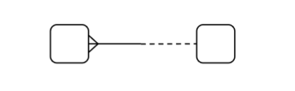
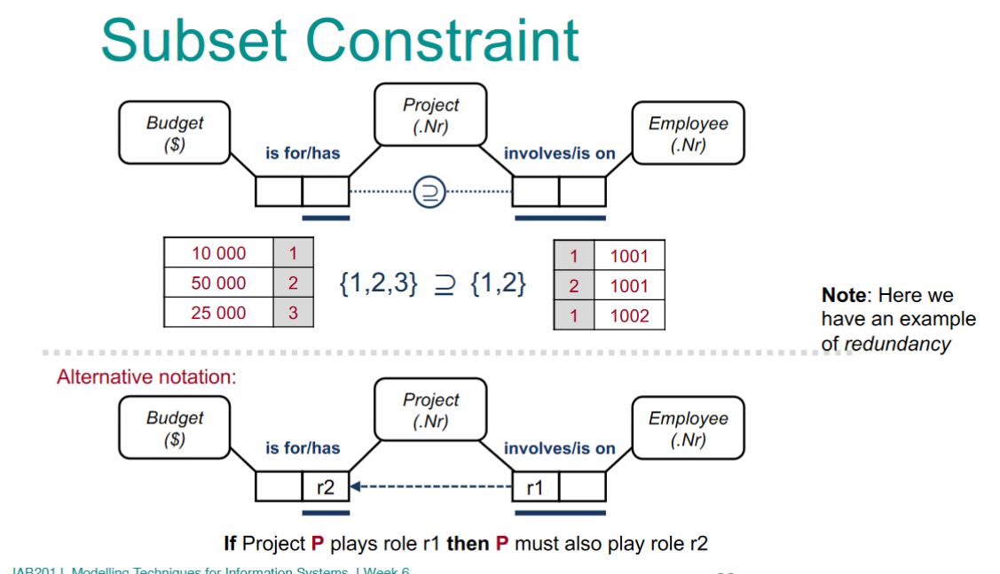

# Week 1

I ceebs, basic shit like what is orm, what is modelling etc. If you need to know this watch the lectures

# Week 2

This week has a focus on Data and information modelling
- Fundamentals

- Entity relationship

- ORM

- Design Procedures

## Functions of an information system

An information system comprises of 3 elements

- Memory
    -I need to know what the information systems looks like right now

- Informative
    - I need to know why the information systems looks the way it does

- Active
    - I need to be able to provide actions that can change the current system

This is all achieved through conceptual modelling.

### Conceptual modelling

Is the activity that elicits and describes the general knowledge a particular info system needs to know, also known as your conceptual schema (aka IFB105)


If you remember these things you know what conceptual modelling is

### What is state?

A state of a domain consists of set of relevant properties, with a domain being the objects and relationships between each states.

A state of domain can consist of a set of objects, a set of relationships and a set of concepts in which they are classified.

### Required domain knowledge

There are a few functions that need to be kept in mind when modelling

- Memory
    - Memory functions maintain representations of states
        - All states need to be represented in our models

- States can vary over time
    - Therefore we must define all potential state changes.

- Representations of states must be consistent
    - We must define when a representation of state is consistent

- Ansering queries require an inference capability
    - Derivation Rules
        - specifiying how a new data type can be derived from the original data

## Concepts and entities

- A concept is an abstract/generic idea generalised from specific instances.
    - A person

An entity consists of 2 things.

- Entity types
    - A concept whose instances are individual, identifiable objects
        - To read a book
    - All entity types have a name that is
        - Unique
        - Meaningful to people who act in the domain
        - Are common nouns in the singular form

- Entity
    - An object that is an instance of an entity type
        - A book


Our concept (a person) who we represent with the name charlotte has tthe entity of a person

Concept flow down through to entity type and then entities

A student (Concept) requires people (entity type), which are then populated with people (entities)

### Attributes

Is a property of an entity, of interest to the domain, is used to qualify, identify ,classify, quantify or in any other way expresss the state of that entity. Attributes should be used to help differentiate entities from one another

Lets take a person a example

The combination of date of birth, name and a signature are usually more than enough to help u differentiate one person from another. Whereas hair colour, eye colour and height aren't as useful.

Another example would be a car. Rego, year of manufacture, the body type, the manufacturer are all good attributes, the top speed and the history of accidents is less so.

An entity should have no more than 8 attributes, if it requires more. You may need to re-analyse your entity

### Cardinality constraints

Is the constraint of an entity type playing a role in a relationshiop. This constraint places a limit on both the minimum and maximum number of entities that can appear in this relationship

```min >= 0, max >= min, max > 0```

To illustrate

Card(Person reads book) = (0,2)
Card(Book is read by Person) = (0,1)

Meaning that a person can read up to 2 books at any given time, while a book can only be read by either noone or one person at a time.

### Entity types and reference modes

Information systems can only use facts as stated - people can misinterpret facts (see politcal argument ever)

The description of an entity MUST specify the entity type being referred to

to illustrate.

- Lee is located in '10b'
    - The patient james is located in the ward '10b'
        - The patient with fname james is located in the ward with name '10b'

## What is information?

Information is data + semantics. With data being the items stored in our system, and the semantics being the meaning behind the data.

Only by considewring the semantics of teh Universe of Discourse (UoD) can a robust, quality information system be designed


## Where is information stored?

Database. If you dont remember IFB105 idk what to tell you pookie

## Elementary facts

A fact that can be explained in a sentence

```Stevie wonder plays keyboard.```

If we want to express that explicitly.

```Person Stevie Wonder plays instrument keyboard. - Concept person plays entity instrument.```

It is a simple statement about the domain.

## Predicates

Whilst elementary facts assert that our entities play roles within our systems, predicates can be used to specify roles. Predicates are expressed via a sentence.

### Surface structures vs deep structures

Where the arity of our predicates are greater than one, we can read them in multiple ways (binary or greater)


`Mary works in sales | Sales employs Mary`

whilst they have different surface structures, they share the same deep structure.

If our predicate was Unary, it would only have a surface structure.

## Keep this in mind


# Week 3

Is a consolidation week, no new content.

# Week 4


## Domains

At any given time, the state of a doman consistes of:

- Objects
- Relationships
- A set of concepts that we use to classify them with.

Eg: We can have our entities of person and vehicle with the relationship of drives.

## Conceptual Modelling Part 2

This lecture takes a focus on conceptual modelling langauges. Namely Entity-Relationship Modelling (ER) and Unified Modelling Language (UML)

### ER


#### ER Language variants

There are a multitude of different notation sets in use for ER. With no standard in place. We will be using the Ellis-Barker (also known as just Barker) notation, which is one of the more popular options

### Barker Notation

Barker is advantagous for us as it:

- Was designed for easy understandability
- Avoids the use of technical components that have no relevance to/may confuse a business user
- Provides limited and consistent set of sumbols
- Provides a complete, concise, clear and unambigious statement of informtion requirements.

Barker Notation is as follows

- We denote a relationship with a line, having

#### Syntax

- An entity type is rounded rectangle with the name at the top and tha attributes at the bottom.


And can use a set of markers to help differentiate the attributes


- We denote a relationship with a line, having an entity type at each end
- The line is composed of two halfs, each half referring to the role the adjacent entity type plays in the realtionship
    - A solid line indicates mandatory
    - A dotted line indicates optional
    - Cardinality is denoted by the presence of a 'Crows Foot' notation joining the line to the entity



    - There are 16 possible relationship combinations


##### Understanding solid to dotted lines


Here we can see that Hire agreements are required for vehicles. But we don't own every car, therefore not every vehicle requires one.

A hiring agreement cannot exist without a vehicle. But a vehicle can exist without a hiring agreement

##### Understanding Many to Many relationships

To make a many to many relationship more readable. We can notate it like this to help improve clarity:


#### Cardinality Cheat-Sheet


### Similarity vs Specificty

In real life we can encounter exampels of objects that share characterisitcs with others. But have a few specific differences that make them distinct from one another. For example, All dogs are mammals. but not all mammals are dogs.

### Supertypes and subtypes

Supertypes are a generic entity type related to one or more entity sub-types and contains common characteristics.

Subtypes contain all of the characteristics of the super type alongside some unique characteristics.

#### Subtype Rules


# Week 5

This is another consolidation week. 

# Week 6

# Conceptual Schema Design Procedure

- Transform familiar examples into elementary facts and apply quality checks
- Draw the fact types and apply a population check
- Check for entity types to be combined and note any arithmetic derivations
- Add uniqueness constraints and check arity (length) of fact types
- Add mandatory role constraints and check for logical derivations
- Add value, set comparison and subtyping constraints
- Add other constraints and perform final checks

## Add uniqueness constraints and check the arity of fact types

I am just going to paste the ones that I feel are important to remember


## Add mandatory role constraints and check for logical derivations

Ditto for previous section


## Add Value, set comparison and subtyping constraints





## Add other constraints and perform final checks

Transofrm ORM to ERD


handy cheat sheet


The little bar indicates mandatory role


an employee can be allocated either a bus pass or a parking bay, not both

# SUPER SUPER IMPORTANT


# Week 7

Consolidation :)
<<<<<<< HEAD

# Week 8

## Sets, Multisets and Relations

- A set is a collection of well defined and **Distinct** objects.
    - The numbers 1, 3 and 5 are distint objects that form a set S = {5 ,1, 3}
- A multiset is a generalisation of a set, where objects do not need to be unique.
    - To apply the same example, M = {1, 3, 5, 3, 1, 5}
- A binary relation over a set is a collection of ordered pairs
    - R = {(1, 3), (3, 1), (5,1)}

## Graphs
- A graph is an ordered pair g = (V, R) **where V is a finite, non-empty set** and R is an irreflexive, symetric binary relation over V**.
    - A binary set is irreflexive if no element is related to itself
    - A binary relation on a set S is symmetric if it holds for all a and b in S that if a is related to b is related to a

To help illustrate this: 
```G = (V, R)
V = {1, 2, 3, 4}
R = {(1, 2),(1, 3),(2, 1),(3, 1),(3, 2),(3, 4),(4, 3),(2, 3)}
```

We refer to V as the **vertex set**, each element of V is a vertex (plural verticies). If we let E denote the set of symmertric pairs in R. Each element in E is called an edge. In this case (1, 2) and (2, 1) are an edge. See the below images for more context :). In a visual context we can see the edge as the line that connects each vertex together. R tells us how to connect each of the Verticies V.


## Networks and Multigraphs

- A network is a graph together with a fucntion that associates a number with every edge of the graph
    - With a function being the relation between a set of inputs and set of permissible outputs


## Vertex Degree

Lets take graph G = ((1, 2, 3, 4, 5)((1, 3)(3, 1)(3, 2)(2, 3)(3, 4)(4, 3)(2, 4)(4, 2))). We can number the edges using vertex degree deg(1) = 1, deg (2) = 2, deg (3) = 3, deg(5) = 0 and so on. This is useful notation to help understand larger graphs.

## Isomorphic graphs

- In many disciplines, it si important to know whether two objects under investigation are the same (in some logical sense) or different.
- Intuitively, the 2 graphsa re the same if it is possible to redraw one of them. As they have the same edges and verticies


- An isomorphism from G1 = (V1, R1) to G2 = (V2, R2) is a function F between V1 and V2, such that for any two adjactent vertices there is an exact replica in the other graphs
- With this we can dictate the G1 and G2 are isomorphic
- Isomorphism is a comparison tool

## Walks, Trails and Paths

- A u-v walk in G, is an alternating sequence of vertices and edges of G, beginning with U and ending with V. Such that every edge joins the vertices immediately preceding it and following it.
- A u-v trail is a walk which **does not repeat any edges**
- A u-v path is a walk which **does not repeat any vertex**


### Circuits and Cycles

> Let U and V be vertices of graph G

- A U-V trail in which u = v and contains at least 3 edges is called a circuit
- A circuit which does not repeat any vertices (except the first and last) is called a cycle


## Connected Graphs

- Two vertices U and V in a graph G are connected if U = V, or if u!= v and a u-v path exists in G
- If a graph G is connected if every two vertices of G are connected, otherwise it is disconnected


- If I remove the edge between V4 and V5, the graph will become disconnected

## Directed Graphs

- A directed graph, or digraph is an ordered pair D = (V, R) where V is a finte non-empty set and R is an irreflexive binary relation on V.

- Remembering that a set is irreflexive if no element is related to itself.

- For example, a digraph D may be defined by V= {1, 2, 3, 4} and R = {(1, 2)(2, 3)(3, 2)}
    - with of course V being the vertex set
    - And R being referred to as a directed edge or arc
    - For consistency we often refer to R as E in notation


### Elementary Concepts and Digraphs
- A directed U-V walk in D is similair to a normal U-V walk. However is a bit more infolved. I CBA typing it out so take this screenshot


#### End lecture 1

## Transition systems

- How we model the behaviour of a system
- A system consists of a set of possible states of the system and a set of state transitions which the system can effect.


- A **state transition** may be the result of an internal action made by the system or of an external action mae by some other system

- A transition system is an annotated directed graph where
    - Vertices are representations of states
    - Directed edges describe each state transition
    - This allows us to graph our transitional systems

- We use the folllowing rules to notate a transition system
    - Using the tuple TS = (S, I, A, T, P. L)
    - S is the set of states
    - I is the initial states
        - Is a subset of S
    - A is the set of actions
    - T is the transition relation
        - See example to gain understanding of this
    - P is a set of atomic propositions
    - L is a labelling function that maps states to a set of atomic propositions

- Example of a vending machine
    - TS = (S, I, A, T, P, L)
        - S = {S1, S2, S3, S4}
        - I = {S1}
            - The loop always starts at S1 in this case, which we can see in the graph
        - A = {a1, a2, a3, a4, a5}
        - T = {(S1, A1, S1),(s2, A2, S3),(S2, A4, S4),(S3, A3, S1),(S4, A5, S1)}
        - P = {P1, P2, P3, P4}
        - L(Si) = {Pi}, i = 1..4


## Model Execution
    - The current state can be decribed by the distribution of tokes over a model.
    - Enablement rules determine which state transition(s) are allowed to happen during the execution of the model
    - the occurence rule allows us to determine the effects of a state change
    - a state cange is selected non-deterministically from the set of enabled state transitions


The e formula shows us that it goes from waiting for payment, to coin insertion, to waiting for selection and so on.

## Behavioural Equivalence

=======

# Week 8

# Week 9
>>>>>>> 983590873055f2057c527e764cbb5fc9a2640bd8