# Week 2

## Question 1 - Physical Models

> A model is a simplified representation of a rela work or an envisioned phenomenon. A physical model of an objet as its physical copy. 

#### Provide some examples of a physical model.

- Larger than
    - Anotomical Models
    - Mechanical components
        - Easier to work with before scaling down for prod

- About the same size
    - Car Prototypes
    - Proof of concept for a chair

- Smaller than
    - Model Airplanes
    - Arcitectural

## Question 2 - Denotation and Connotation

#### Provide examples of signes, symbols or objects that have different denotaiton and connotation

- Denotation
    - A house can be denoted as the place where people live
    - A road sign is denoted as a message for a driver to pay attention to
- Connoation
    - The word home hold a positive connation. Of being a comfortable place to be
    - The connotation of a road sign implies a warning. Or something that a driver needs to pay attention to

## Question 3 - A Simple Modelling Lanugage

This question involves fixing a series of models. 

Rules are as follows:

> I have drawn in which rule is being broken in each question.

#### A.

#### B.

#### C.

#### D.

#### E.

#### F.

## Question 4 - The blind men and the elephant

> I am just going to paste the image of the question.

#### Provide a sketch, picture or photo of this creature, object or collection of objects

I dont really understand the point to this question.

The 'Elephant' can be the following (imo):

- An actual elephant

- A spear, wall, tree, snake, fan and rope all arranged together to be like an elephant

They are all looking at the data from a different perspective. Therefore coming up with conflicting information?

# Week 3

## Question 1 - Elementary Facts

Assuming suitable entity types and reference modes are understood, which of the following senstences express exactly **ONE** elementary fact?

- Adam likes Eve - Yes
- Bob does not like John - Yes
- Julie is tall and slim - No
- Tom visited LA or New York - No
- If steve visited LA, then New York - No
- Sue is funny - Yes
- All people are funny - No
- Some people prefer using apple products - No
- Brisbane and Sydney are in Australia - No
- Who does Adam like - No

## Question 2 - Making Facts Explicit

Indicate at least **Two different semantic** interpretations for each of the following senences by rewriting them to include their entity types and reference modes

- Mickey Likes Pluto
    - Mouse Mickey likes Dog Pluto
    - Dog Pluto is liked by Mouse Mickey

- Dallas is smaller than Sydney
    - City Dallas is smaller than City Sydney
    - City Sydney is larger than City Dallas

- Arnold can press 300
    - Person Arnold can press Weight 300
    - Weight 300 can be pressed by Person Arnold

## Question 3 - Names and Genders

The names and gendder of various people are indicated below:

> Male - Fred, Tom
> Female - Ann, Mary, Sue

Express the information about Fred and Ann as undary elementary facts

- Fred is a Male
- Ann is a Female

Express the information as binary elementary facts

- Fred and Tom are males
- Ann, Mary and Sue are females

## Question 4 - Verbalising Elementary Facts

With the tables provided, translate them into elementary facts.

High Jumper Jones EM can jump Height of 400cm (Unary)

Person Chun E has Height of 166cm and born in Year 1955 (Binary)
Person Chun E has Height of 166cm (Unary)

Parent Suraj parents Child Harshal (Unary)

Fruit Apple is Grown in Countries Australia, America and Ireland (Ternary? Or whatever the 4 one is idfk idfc)

## Question 5 - Family Tree

A family tree application may be considered an example of an information system. Thinking about the three main functions of information systems:

- What concepts will need to be stored by the system? Descrive in text the entities, relationships and attributes that would form its conceptual schema
    - Entities
        - Person
            - id, fname, lname, dob, gender
        - Marriage
            - Family ID, Family Name
        - Family
            - ID

    - Relationships
        - Parent to child
            - Parent ID, Child Id
        - Spouse
            - Spouse 1 ID, Spouse 2 ID, Marriage ID
        - Siblings
            - Family ID, Sibling 1 ID, Sibling 2 ID
    

- What kinds of information might be retrieved from the system, give 5 or 6 explicit exmaples of:
    - Information that may be retrieved directly from the concepts stored
        - Person informaiton
        - Marriage information
        - Sibling information
    - Information that may be derived from the concepts stored
        - Ancestry
        - Descendents
        - Generational gaps
        - Marital connections

- What changes of state should be allowed? More specifically, are there any potential changes of state that should be disallowed? If so, why?
    - Allowed
        - Adding new individuals
        - Changing individual information
        - Record deletion
        - Creating Persons, Marriages, families

    - Disallowed
        - Multi Spouse relationship (without proper context)
        - Duplicate entries

# Week 4

## Question 1 - Model Translation

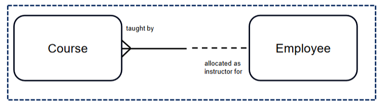

Course always needs to be taught by an employee. But an employee doesnt nescesarily need to teach a course. An employee can teach many Courses

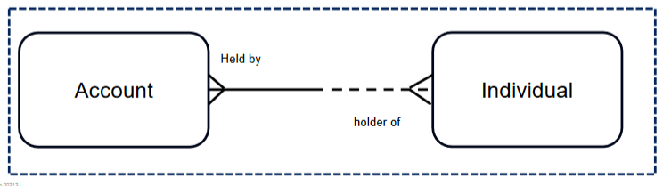

An accounts is always held by an individual. But an individual hodling an account is optional. Many accounts can be held by a singular individual.

## Question 2 - Text Description to Model

Draw information models using Barker entity relationship notation to represent the following scenario statements

- A salesperson is always employed within a single sales region; a sales region can be staffed with many salespersons

    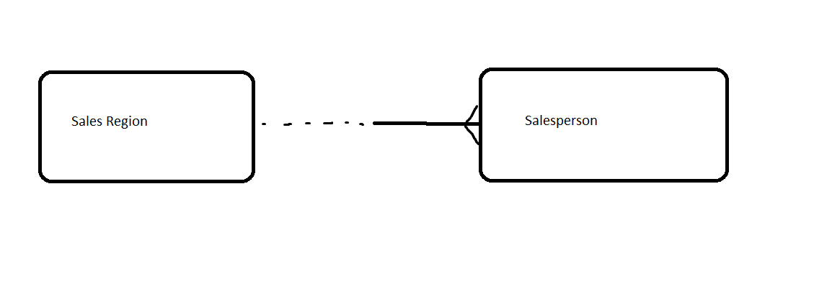

- A flight must always be from one airport and must always be to an airport (which may or may not be the same airport); an airport can be the departure airport or the arrival airport for a flight
    - Honestly not too sure about htis one, check the answers.

    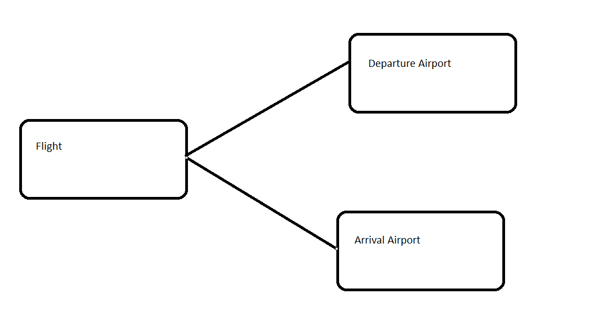

    - I was partially correct. Needs to look like this:

    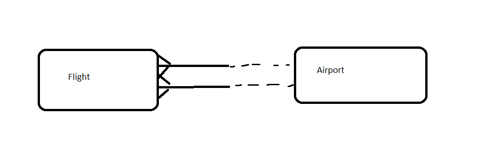

- An actor can play roles in many films; a film can have many actors palying roles

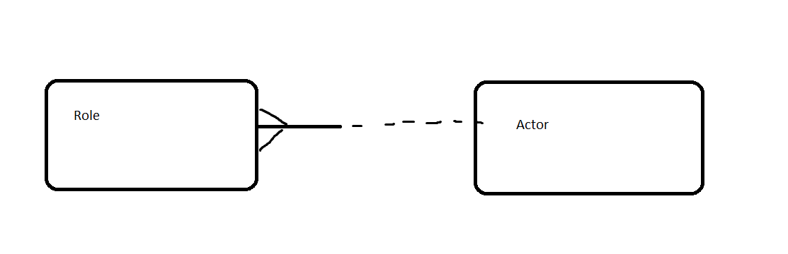

## Question 3 - From Description to Model

Draw an ER model with Barker notation to model the information found in the following description.

- A university consists of a number of faculties. Each faculty offers several
courses. A number of units make up each course. Students enrol in a
particular course and take units towards the completion of that course. Each unit
is taught by a lecturer from the relevant faculty, and each lecturer also tutors a
group of students

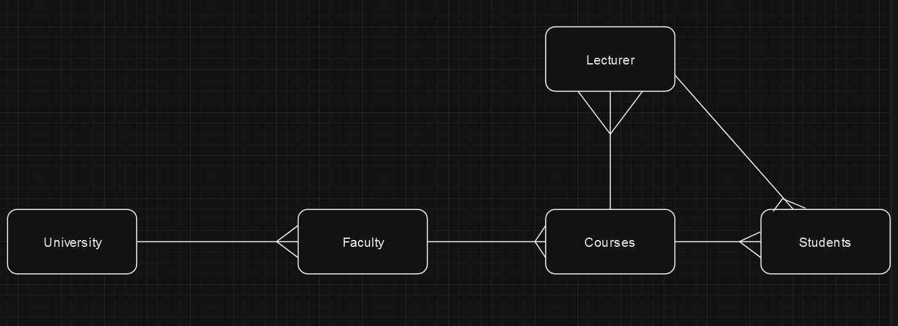

# Week 5

skipped

# Week 6

skipped

# Week 7

Consolidation

# Week 8

## Question 1 - Isomorphic graphs

G1 and G2 as they have the same number of vertices

likewise with G3 and G4

## Question 2 - The Handshake Problem

- Frank and Jeff are partners
- They decide to hold a party and invite 4 other couples
- There are a number of greetings
- Naturally a person does not greet themselves, nor does anyone greet their own partner
- Also, any two people may only greet each other once

At the end of the party, Frank asks everyone how many people did they greet, and receives 9 different answers

G = S, R

S would be 8 and there is no point doing these retro, focus on current tutorials

# Week 9

## Question 1 - Beverage Vending Machine

Consider the transition system below, which models a vending machine, this system was also in week 9 lecture

> Extend the transition system to allow refilling soda drinks that may have run out upon customer selection. Assume that juice drinks are always avail

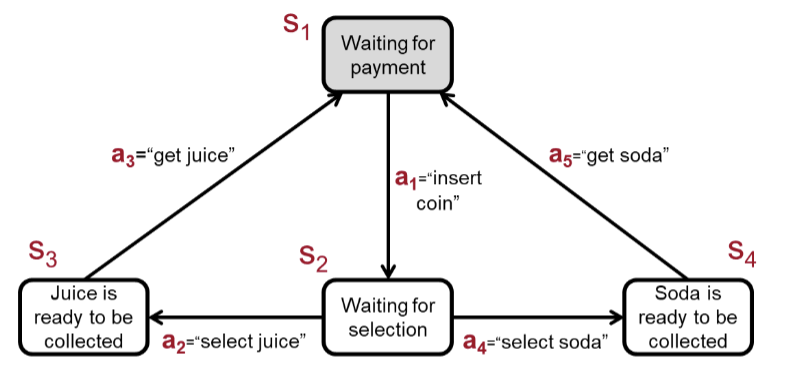

I am not going to bother adding the existing action points. Onliy the ones that I am adding

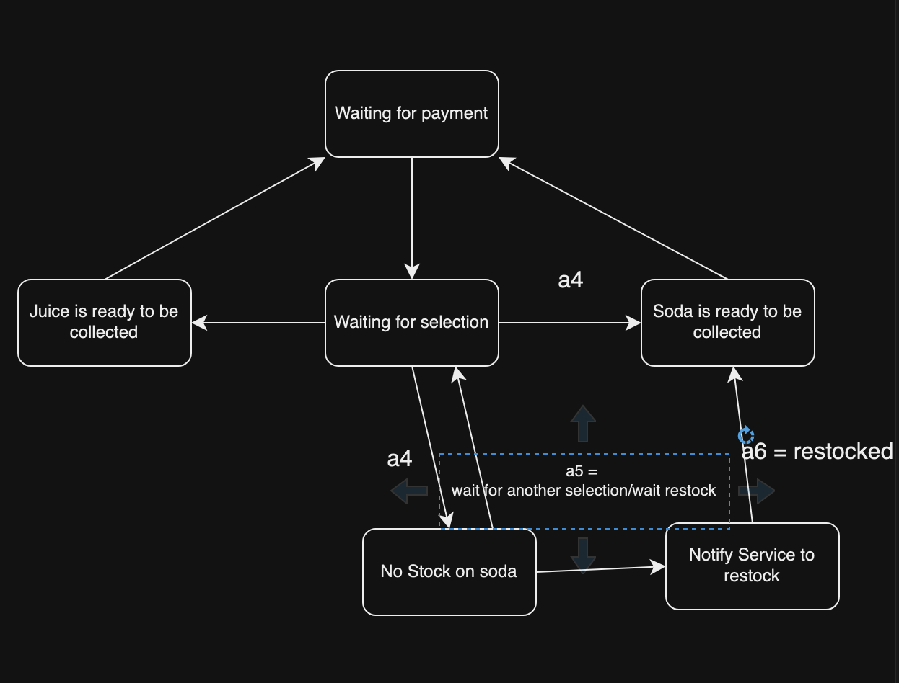

## Question 2 - Weaving Machine

A transition model that models the running mechanism of a very simple weaving machine is defined as follows

- T + {S, I, A, T, P, L}
    - S = {S1...s6}
    - I = {S1}
    - A = {"prepare", "liftwarp1", "liftwarp2", "increment thread count", "load thread", "return shuttle", "finish"}
    - T = im not righting this out, s1 is placed with a1 and vice versa. i set it up chronoligcally
    - P = {P1...P6}
    - L = L(S1) = p 1, L(S2) = p 2, L(S3) = p 3, L(S4) = p 4, L(S5) = p 5, L(S6) = p6

> Draw a complete graphical representation of this transition system

> How many times will the TS be in state "Shuttle at Right" for the minimum possible number of state transitions

> How many times will TS be in state "Shuttle at Right" for the execution that includes all actions at least once and has the min possible number of state transitions?

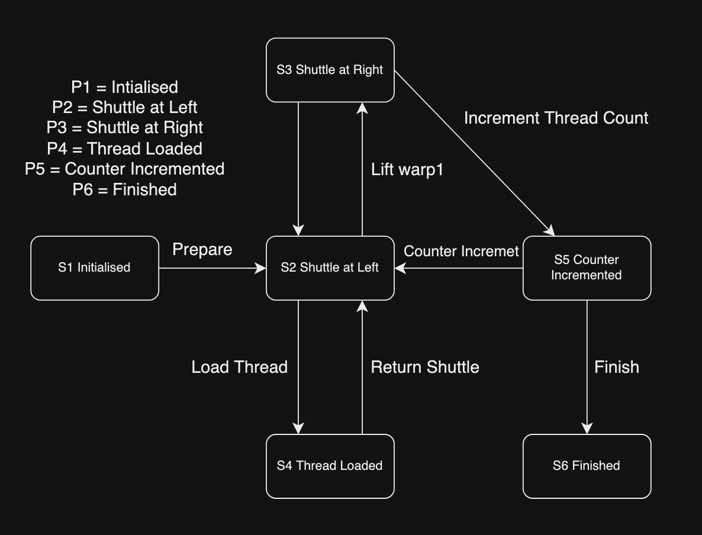

and for the other two questions its 1 and 2 respectively. In theory we can just pass it once and finish. However if we want to pass all we have to go through it one mroe time to go through the "Counter Incremented" action :)

## Question 3 - Behavioural Equivalence

> Determine for each pair of transition systems (a-d) whether they are isomorphic, bisimilair or trace equivalent

> Something to keep in mind here is that an isomorphic is Bisimilair and Trace equivalent by default. However a Trace equiavlent system usually isnt bisimilair. They are like normal forms in SQL, see picture below :)

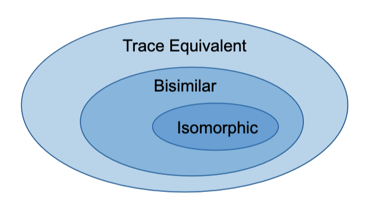

### Graph A

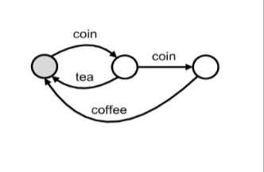

### Graph B

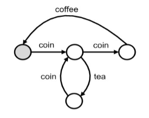

> The extra coint at the tea point means that the user in this system is allowed to change their mind and get a coffee instead of they add an extra coin i think? This is illustrated better in graph C tbh

### Graph C

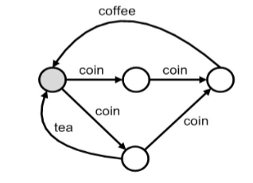

### Graph D

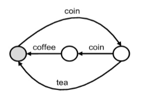

### Comparison

# TODO: Put this in a fancy table

Graph A - B: Bisimilair, Trace Equivalent

Graph A - C: Trace Equivalent

Graph A - D: Isomorphic, Bisimilair and Trace Equivalent

Graph B - C: Isomorphic, Bisimilair and Trace Equivalent

Graph B - D: Trace Equivalent

Graph C - D: Trace Equivalent