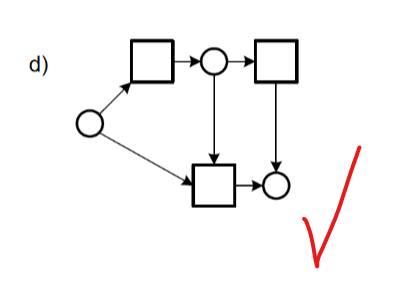

# Week 2

## Question 1 - Physical Models

> A model is a simplified representation of a rela work or an envisioned phenomenon. A physical model of an objet as its physical copy. 

#### Provide some examples of a physical model.

- Larger than
    - Anotomical Models
    - Mechanical components
        - Easier to work with before scaling down for prod

- About the same size
    - Car Prototypes
    - Proof of concept for a chair

- Smaller than
    - Model Airplanes
    - Arcitectural

## Question 2 - Denotation and Connotation

#### Provide examples of signes, symbols or objects that have different denotaiton and connotation

- Denotation
    - A house can be denoted as the place where people live
    - A road sign is denoted as a message for a driver to pay attention to
- Connoation
    - The word home hold a positive connation. Of being a comfortable place to be
    - The connotation of a road sign implies a warning. Or something that a driver needs to pay attention to

## Question 3 - A Simple Modelling Lanugage

This question involves fixing a series of models. 

Rules are as follows:

> I have drawn in which rule is being broken in each question.

#### A.

#### B.

#### C.

#### D.

#### E.

#### F.

## Question 4 - The blind men and the elephant

> I am just going to paste the image of the question.

#### Provide a sketch, picture or photo of this creature, object or collection of objects

I dont really understand the point to this question.

The 'Elephant' can be the following (imo):

- An actual elephant

- A spear, wall, tree, snake, fan and rope all arranged together to be like an elephant

They are all looking at the data from a different perspective. Therefore coming up with conflicting information?

# Week 3

## Question 1 - Elementary Facts

Assuming suitable entity types and reference modes are understood, which of the following senstences express exactly **ONE** elementary fact?

- Adam likes Eve - Yes
- Bob does not like John - Yes
- Julie is tall and slim - No
- Tom visited LA or New York - No
- If steve visited LA, then New York - No
- Sue is funny - Yes
- All people are funny - No
- Some people prefer using apple products - No
- Brisbane and Sydney are in Australia - No
- Who does Adam like - No

## Question 2 - Making Facts Explicit

Indicate at least **Two different semantic** interpretations for each of the following senences by rewriting them to include their entity types and reference modes

- Mickey Likes Pluto
    - Mouse Mickey likes Dog Pluto
    - Dog Pluto is liked by Mouse Mickey

- Dallas is smaller than Sydney
    - City Dallas is smaller than City Sydney
    - City Sydney is larger than City Dallas

- Arnold can press 300
    - Person Arnold can press Weight 300
    - Weight 300 can be pressed by Person Arnold

## Question 3 - Names and Genders

The names and gendder of various people are indicated below:

> Male - Fred, Tom
> Female - Ann, Mary, Sue

Express the information about Fred and Ann as undary elementary facts

- Fred is a Male
- Ann is a Female

Express the information as binary elementary facts

- Fred and Tom are males
- Ann, Mary and Sue are females

## Question 4 - Verbalising Elementary Facts

With the tables provided, translate them into elementary facts.

High Jumper Jones EM can jump Height of 400cm (Unary)

Person Chun E has Height of 166cm and born in Year 1955 (Binary)
Person Chun E has Height of 166cm (Unary)

Parent Suraj parents Child Harshal (Unary)

Fruit Apple is Grown in Countries Australia, America and Ireland (Ternary? Or whatever the 4 one is idfk idfc)

## Question 5 - Family Tree

A family tree application may be considered an example of an information system. Thinking about the three main functions of information systems:

- What concepts will need to be stored by the system? Descrive in text the entities, relationships and attributes that would form its conceptual schema
    - Entities
        - Person
            - id, fname, lname, dob, gender
        - Marriage
            - Family ID, Family Name
        - Family
            - ID

    - Relationships
        - Parent to child
            - Parent ID, Child Id
        - Spouse
            - Spouse 1 ID, Spouse 2 ID, Marriage ID
        - Siblings
            - Family ID, Sibling 1 ID, Sibling 2 ID
    

- What kinds of information might be retrieved from the system, give 5 or 6 explicit exmaples of:
    - Information that may be retrieved directly from the concepts stored
        - Person informaiton
        - Marriage information
        - Sibling information
    - Information that may be derived from the concepts stored
        - Ancestry
        - Descendents
        - Generational gaps
        - Marital connections

- What changes of state should be allowed? More specifically, are there any potential changes of state that should be disallowed? If so, why?
    - Allowed
        - Adding new individuals
        - Changing individual information
        - Record deletion
        - Creating Persons, Marriages, families

    - Disallowed
        - Multi Spouse relationship (without proper context)
        - Duplicate entries
