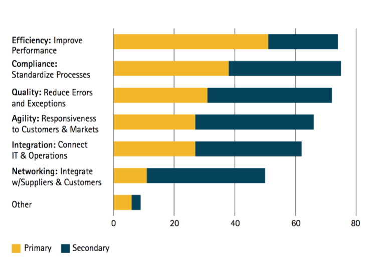
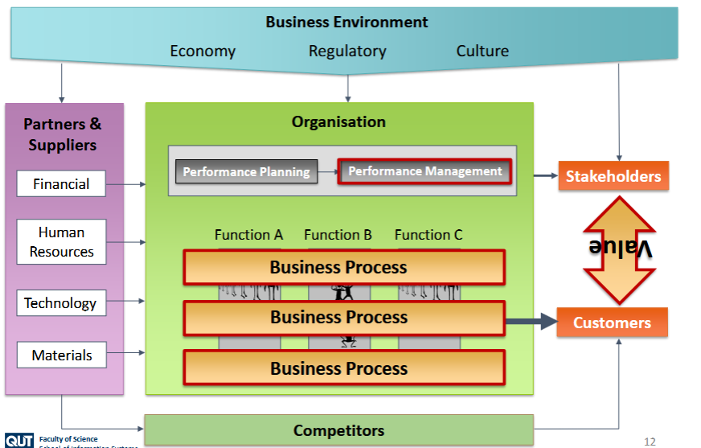
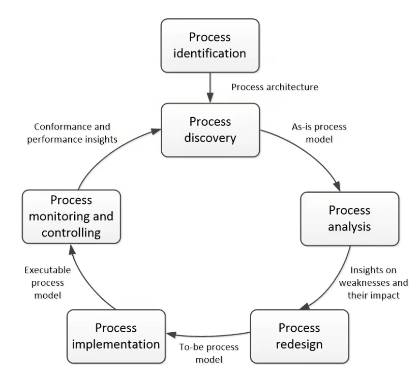
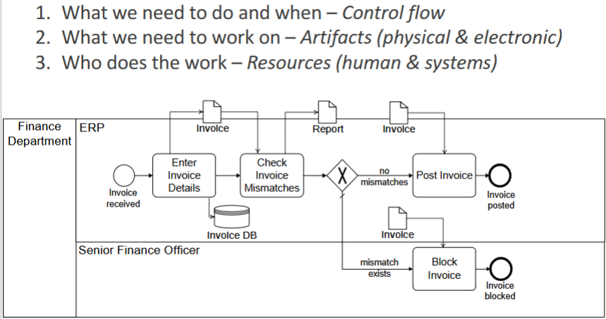

# Week 1

## What is a business process?

A business process is a **Triggered** series of events, activities and decisions, that often involve a variety of manual and automated tasks (usually across different business functions (departments)) that leads to an outcome that provides value to a stakeholder, whether that be a customer or internal user.

Take a sit-down restaurant, the business process will be as follows:
- Customer arrives
    - The Host(ess) will:
        - Greet the customer and provide them with a seat
    - Waitstaff will:
        - Provide the customer with a menu
        - Take order
        - Provide order to waitstaff
    - The kitchen staff will then
        - Cook the meal for the customer
        - Alert waitstaff that meal is ready to take to customer
    - Waitstaff will:
        - Provide meal to the customer
        - Present the bill
        - Collect payment

### What is business process management?

A set of principles, methods and tools to manage our business processes. With the goal of improvement in mind. BPM provides us with several benfits, such as improved compliance, efficiency, integration, quality and more

## Rummler's framework

Nothing really beats the lecture when it comes to explaining this, but to summarise:
- In the centre we have our organisation, this is where all of our business process lie
- On the far left are our business inputs
    - Human resources
    - Raw materials
    - Technology
    - Capital
- Competitors also have access to these inputs, which allows them to potentially provide more value to the customer and take business off of you
    - Rummler's framework also stipulates that there is also competition inside of the business inputs as well.
        - If there are a lot of job seekers, the competition for the input into the business is low
        - If the interest rates are cooked, the competition is high
- The business environment is external forces that operate on the business
    - Economy
    - Laws and regulations
    - societal norms and cultures
- all of these either directly or flow through to influence or provide value to the customer or stakeholder

## The BPM Lifecycle

BPM is an ongoing process, that never truly ends.
- We start with identifying and understanding the existing process architecture
    - What process exist currently? What do they do
        - This is important as we can gain insight into how they will impact the new process that we create
- From here we flesh out the process
    - This is where we create the process model
        - Input and output, and the rough steps we need to take in order to get there
            - This is the rought draft of our process
- Next, we analyse this process
    - What are the risks?
    - How expensive will this be to implement?
    - What impacts does this have on our business
- With this analysis in mind, we will then redesign the process into its final form
    - We create a new model called a To-be process model
        - Is super important that we involve the process participants and owner in on this section.
- Next we implement
    - Executable process model is created here
- Finally, we monitor the process and put controls in place if needed
    - This part is owned by system administration

> It is important in this process, that we keep in mind what we need to and when, what we need to work on and who does the work.

## Modelling Theory

Read the lectures notes if you need this, you learnt this in IAB201