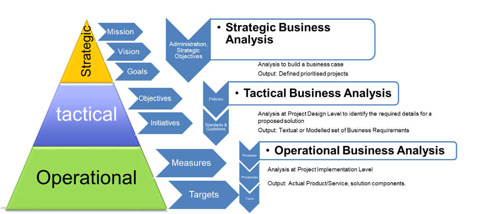
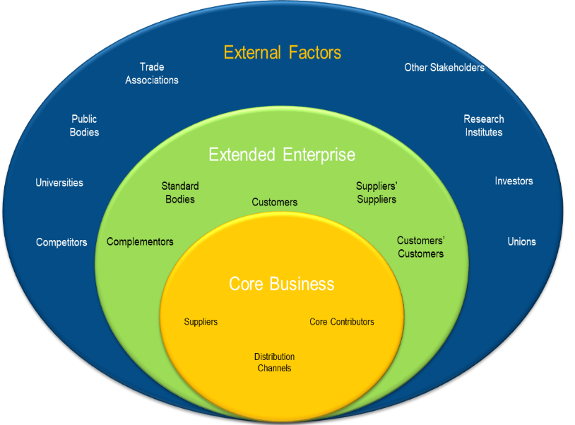
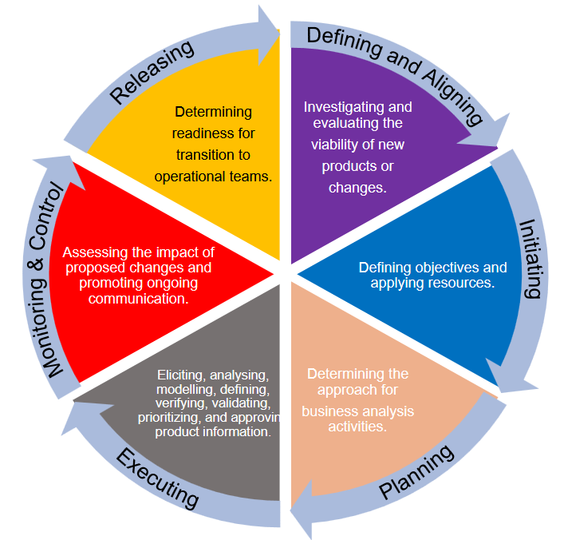

# Week 1

Year 8 business throwback, mostly talking about SWOT and PESTLE analysis

## What is business analysis
- The applciation of knowledge, skills and techniques
- The ability to indentify needs, issues, pain points and oppurtunities
- Liaising among stakeholders to gather, document and manage their requirements
- Suggest solutions to help an org achieve its goals
- Facilitate success

### Why are BAs important?

- 47% of unsuccessful projects fail due to poor requirements management
    -39% of failed projects cite inaccurate requirements gathering as a primary cause
- Orgs with mature business analysis practices are 55% more successful when implementing strategies
- Improved business analysis skills and practices provide a competitives advantage

## Levels of business analysis

## Business ecosystem

## BA process life cycle

## Influences on the analysis process

- Enterprise Environmental Factors (EEF)
    - Are conditions not under the immediate control of the team
        - Influences the projet, portfolio or prgram
        - These conditions influence, constrain or provide direction on how analysis is conducted
- Organisational Process Assets (OPA)
    - The plans, processes, policies, procedures and knowledge bases specific to and used by the performing organisation
        - Grouped into 3 fiels
            - Business an procedures
                - Policy, procedures, guidelines, standards, risk management etc
            - Corporate knowledge bases
            - Team and SME knowledge

## Pestel Analysis

> Used to find external EEF that will get in the way of the teams ability to complete their project

- 6 fields to populate (with examples of what sits in each)
    - Political
        - Tariffs
        - Stability
        - Corruption
        - Taxation
        - Laws
    - Economic
        - GNP/GDP
        - Inflation
        - Interest rates
        - Employment
    - Social
        - Population
        - Demography
        - Lifestyle
        - Culture
    - Technology
        - Infrastructure
        - Innovation
        - Automation
        - Research and development
    - Environment
        - Climate impact
        - Ethics
        - Sustainability
    - Legal
        - Antitrust
        - Labour
        - Copyright
        - Data protection laws
        - Health and safety

## Swot Analysis

> Finds both external and internal EEF

- 4 fields
    - Internally
        - Strengths
        - Weaknesses
        - Examples include
            - Assets
                - Or lack thereof
            - People
            - Systems
            - etc
    - Externally
        - Oppurtunities
        - Threats
        - Examples include
            - Current state of the market
            - Competition
            - Current trends in society
            - What regulations will act on us