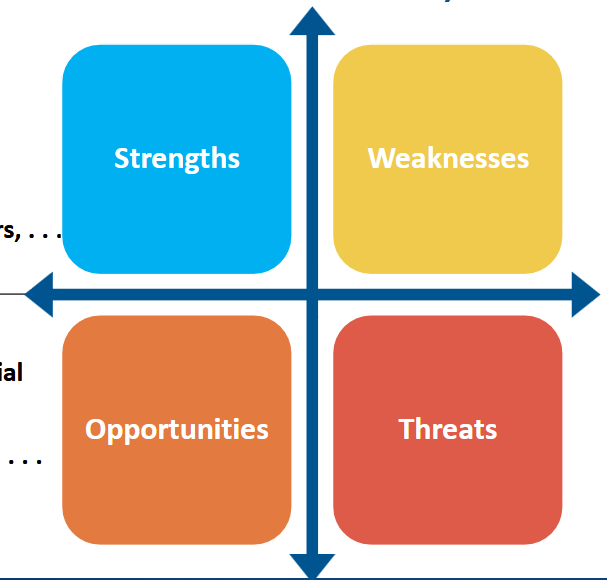

# Week 1

Year 8 business throwback, mostly talking about SWOT and PESTLE analysis

## What is business analysis
- The applciation of knowledge, skills and techniques
- The ability to indentify needs, issues, pain points and oppurtunities
- Liaising among stakeholders to gather, document and manage their requirements
- Suggest solutions to help an org achieve its goals
- Facilitate success

### Why are BAs important?

- 47% of unsuccessful projects fail due to poor requirements management
    -39% of failed projects cite inaccurate requirements gathering as a primary cause
- Orgs with mature business analysis practices are 55% more successful when implementing strategies
- Improved business analysis skills and practices provide a competitives advantage

## Levels of business analysis

## Business ecosystem

## BA process life cycle

## Influences on the analysis process

- Enterprise Environmental Factors (EEF)
    - Are conditions not under the immediate control of the team
        - Influences the projet, portfolio or prgram
        - These conditions influence, constrain or provide direction on how analysis is conducted
- Organisational Process Assets (OPA)
    - The plans, processes, policies, procedures and knowledge bases specific to and used by the performing organisation
        - Grouped into 3 fiels
            - Business an procedures
                - Policy, procedures, guidelines, standards, risk management etc
            - Corporate knowledge bases
            - Team and SME knowledge

## Pestel Analysis

> Used to find external EEF that will get in the way of the teams ability to complete their project

- 6 fields to populate (with examples of what sits in each)
    - Political
        - Tariffs
        - Stability
        - Corruption
        - Taxation
        - Laws
    - Economic
        - GNP/GDP
        - Inflation
        - Interest rates
        - Employment
    - Social
        - Population
        - Demography
        - Lifestyle
        - Culture
    - Technology
        - Infrastructure
        - Innovation
        - Automation
        - Research and development
    - Environment
        - Climate impact
        - Ethics
        - Sustainability
    - Legal
        - Antitrust
        - Labour
        - Copyright
        - Data protection laws
        - Health and safety

## Swot Analysis

> Finds both external and internal EEF

- 4 fields
    - Internally
        - Strengths
        - Weaknesses
        - Examples include
            - Assets
                - Or lack thereof
            - People
            - Systems
            - etc
    - Externally
        - Oppurtunities
        - Threats
        - Examples include
            - Current state of the market
            - Competition
            - Current trends in society
            - What regulations will act on us

# Week 2

## Business Value Assessment

BVA involves analysing current problems/oppurtunities and providinga viable solution, we need to ensure that these solutions align with the org's strategy and meets the needs of the business

When conducting a BVA, there are 3 primary steps:

### Understanding the situation

To begin, we first need to understand the What, How and Why of the situation. What is the problem, how did it occur, and why it was made. To help us arrive at these, we use the below process.

Good change to use customer journey maps, understanding the stakeholder is just as important as understanding the situation. Key details like age, occupation, location, background, What they want to achieve and more are things to gather and keep in mind.

We also need to understand how big of a problem this is problem/oppurtunity is.

Another portion of this is understanding the root cause as to how this situation has presented in the first place, issues such as the 5 whys, fishbone diagrams and analysing the existing process are suitable for this.

### The Six thinking hats

- Explain each hat to the group
- Choose the problem that you would like to discuss
- Go through each of the hats
- Document key points of each hat
- Make a choice and take action

Once we have understood the overall situation, we now create a set of goals and objectives, to understand the size of the project and start an action plan.

### Find the Gaps

- Determine the area to be analysed based on the situation and root causes
- identify the internal and external factors on the situation
    - Pestle
    - Swot
    - Catwoe
- Analyse existing capabilities using historical data and business capability analysis
- Find the desired future state for these capabilities and performance indicators
- Analyse the fap to compare the current and desired states
    - Quantify the difference

### Define the solution

- What needs to be delivered
- How is this delivered?

# Week 3

## Defining the solution

- Bringing information together from the business to support the selection of a final solution
    - Ensures that we implement the right solution
    - Allows us to find alternatives to anticipate stakeholder expectations
    - Develop comprehensive business cases and roadmaps to guide implementation and manage expectations

### How to Define the Solution
- Determine our options using prioritization and categorisation techniques
    - For each option, perform and analysis ti identify assumptions, constraints, risks, dependencies, intended benefits and disbenefits related to the options
- Assess viability/feasibility of each option
- Create business case
    - Collect information from BVA
- Engage the team to determine the solution approach and develop roadmap deployment

## Idea Generation

### SCAMPER

### Lotus Blossom
- Describe the problem
- Surround it with ideas using brainstorming techniques
- Unfold teh lotus blossom (make new ideas from the ideas that you just made)
- Seek practical answers to the problem

## Prioritisation

Prioritisation is not an absolute process, you will need to negotiate and quantify why something goes where it goes.

Stakeholders will often:
- Avoid difficult decisions
- Fail to recognise the need for a trade-off
- Weigh everything too high

In cases like this, its important to ask them what the outcome would be if the requirement didn't exist, ask them if there are existing systems in place, urgency, and potential risks if addressed later.

Technical staff may influence these priorities through misleading advice on implementation difficulty

### Prioritisation Techniques

Moscow:
- Must have
- Should have
- Could have
- Won't have

There are a bunch more, would be wiser to go through the slides tbh.