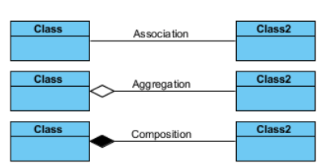

# Week 1

> ok this is a bit of a super week

## Statis vs Dynamic Web Apps


> Static web apps will display the same content to the user, wheras dynamic sites allow for personalisation for a tailor-made experience

Web apps are a **thin client** and differ heavily from other types of applications.

## Model View Controller (MVC) Software Design Pattern

- MVC outlines that data should be isolated from the presentation
    - Like all apps, data layer should be seperate from presentation layer
- A web app can have multiple presentations for the same data
    - In the case of a dynamic web apps
- The intention of MVC is to isolate the what, how and its presentation
    - Model (what)
        - Data or information for your application
        - Provides access to the systems data and business rules
        - Can contain a bit of business logic
            - Such as managing data consistency
    - Controller (how)
        - Processes/formats the information in the model
            - Prices/discounts
            - Review rating
            - Orchestrates interaction between the view and model
        - View (presentation)
            - Displays the model and allows the user to interact with the model
            - Allow interactions with user to edit model where relevant
            - An advantage of using MVC is that you can change the view without impacting the rest of the system


> As mentioned prior, the presentation is abstracted from the data layer, the controller acts as an intermediary between the two

## Web application design process

- Is completed over 4 steps
    - Requirements
        - Gather requirements for application/feature
    - User story
        - Make a user story (See below)
    - Conceptual Model
        - Use user stories to identify concepts related to our web app
            - Refine concepets to represent the classes (object type) required in application
            - Also allows us to find associations between them and their attributes and methods
    - Data model
        - Convert conceptual model to data model for the application

## Developing user stories

> I am going to omega gloss over this since I already do this at work

The gist of this is, a user story is a short description of what the user requires. Told from the first person.

they use this format:

```
Title: as a ____ I require/want/need ____ to do ____ (sometimes a reason is good here)

Description: Provide details on the functionality that is required

Acceptance criteria: what is the outcome that the user requries
```

So if we apply this to a retail staff member wanting to be able to have a new screen created that allows them to view stock of neighbouring stores. it would look as follows

```
Title: As a sales assistant, I need to view other stores stock on hand screen to provide real time information to customers

Description: Sales assistants are encountering experiences with customers asking if there is stock at another location. To complete this request, the staff member is required to call the store on the customers behalf in order to get this information and relay it to the customer. etc etc etc

Acceptance criteria:
- An independant screen on __ that allows stores to see the stock on hand of a given item across all stores in a region
- More requirements here im not doing all of this
```

The way the unit teaches user stories is also fine, which ditches the description in favour of a more detail rich title.

## Developing the Conceptual Model

The point of the conceptual model is to help identify relevant concepts related to the problem raised in the US.

When developing the conceptual model, we need to follow these 5 steps:

- Identify Objects
    - Look at your list of User stories
    - Find the nouns
        - As a *user* I need to view *stock* on hand for all *locations*
    - Discover the concepts or classes
        - User
        - Stock
        - Locations
    - Find the relationships between these concepts
        - an assosciation is when one objects is related to another object in a US (from a semantic perspective)
            - Think about databases
                - Sales assistant checks stock on hand
                - The next few slides are literally just UML

- Identify Relationships
- Refine Objects
    - Can these concepts live independently? Or do they need to be attributes of an existing object
        - Makes it possible to lcoate duplicates or other redundant concepts
        - It is wise to use lucid chart for something like this to help visualise


- It is important to clarify the difference between association, aggregation and composition
    - Association is the realtionship where an object contains some other objects
        - Store has employees
    - Aggregations is when two objects and exist independently
    - Composition is the same as aggregation, but has an implied ownership
        - Plane has wings



- Inheritance is similair to the above, is important to touch on seperately, inheritance when an object is a type of another object
    - An administrator and customer are both users
    - they should be annotated as follows.


- Decide multiplicity of relationships
    - How many objects of one class is related to the objects of another class
        - 1 to 1
        - 1 to many
        - 1 to 0 to many
        - many to manu
        - you should know how these relationships works if you did database managements or literally any other IAB unit

- Identify functions/responsibilities
    - Identify verbs
        -  As a user i want to **view all the hotels** of the hotel chan and their locations
    - These verbs need to be assosciated to a class
        - A class needs to be responsible for itself
            - Creation
            - Updates
            - Retrieval of information of object
            - Deletion of object
        - **View all hotels** should belong to the hotel class, and not something like the room class

## Developing the data model

- Applciations stores persistent data in database
    - is only concerned with data and relationships
    - Our classes become entities (UML)
    - This is a relational database of our website essentially

## Developing the views/wireframes

The wireframe is our non-working protype of how the website should look in a low fidelity representation and allows us to evaluate the effectiveness of a page and determine the requirements.

