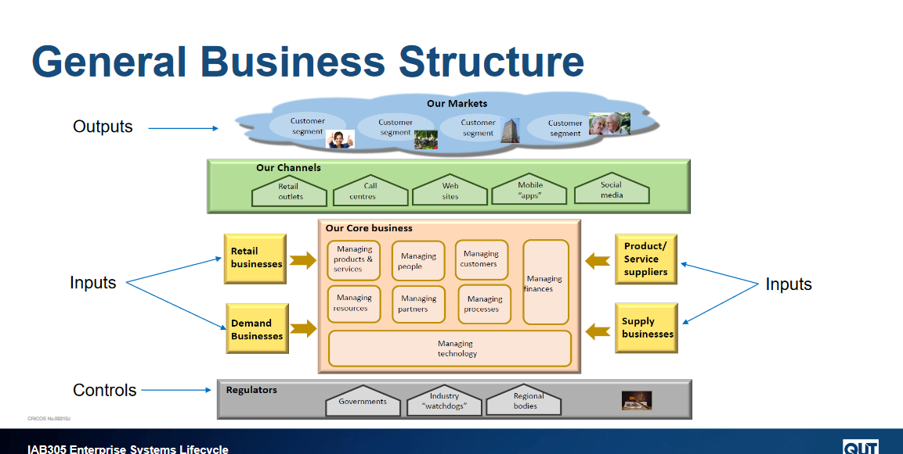

# Week 1

No tutorial

# Week 2

## Important content

This is mostly a setup week.

### General business structures

### There are 4 things to keep in mind when looking at the general structure of a business:

 - Customer segments - specific groups of people in society that organisations support, or sell to with their products or services
    - eg school kids, adults, business workers and retirees are different customer segments for a company that wants to sell Bicycles or a company that wants to sell food

 - Customer channels - are **HOW** your customers get access to your product or service
    - eg ecommerce, brick and morter stores, mobile apps

 - Product/service suppliers - organisations that supply products/services to organisations for use in internally running the business, supporting the business' creaiton and combing with other products/services for sale to the market
    - eg manufacturers buying raw materials to fabricate into components and businesses buying those components to create their products

 - Supply Businesses - similair to product suppliers, but these organisations business generates business for another org
    - governments, sports assosciations.

### Why does a business need IS systems?

To manage operations, communicate, for sales, marketing and decision making, customer and supplier intimacy and the creation of competitive advantages

### There are 4 types of information systems
 
  - Transaction Processing Systems (TPS)
    - Collects, modifies and retrieves all transaction data
        - Often used for financial transaction processing

  - Management Information System (MIS)
    - Used for monitoring and reporting daily or weekly sales and inventory data, payroll and more

  - Decision Support System (DSS)
    -  Used by middle management to generate reports and aid decision making
  
  - Executive Information System (EIS)
    - Used by execs to generate reports for strategic decision making

### What goes into an information system?
 
 - Hardware
    - Physical computer hardware
    - Input/output interfaced
    - Comms and storage devices
 
 - Software
    - Computer programs that enable the hardware to functions

 - Data
 
 - Polcies/processes
    - Governs the operation of the system

 - People
    - Users
    - Support

### Static vs adaptive systems

### The hierarchy of decision making

The higher someone is in an organistion, the more open ended, long term and infrequent a decision has to be made. We will be focusing on the highhest point of this.

#### What is strategic decision making?

A strategic decision is one that is long term, Can be based on what competitors are doing and often considers changes in technology

#### Why change?

Change is often forced upon a business due to changes in market, disruptive changes in tech, stakeholder influences, legal changes, unforseen circumstances and more.

If we don't change it can often lead to collapse in share price, loss in market share, mass resignation, loss of business and potentially business collapse

#### How do we avoid strategic failure?

To avoid failure in are strategies we should establish and follow a strategic plan. To create this we need to ask ourselves a few questions.

 - What is our current business situation?

 - What do we want the business to be?

 - Being sure to consider the businesses
   - Mission
      - The current state/purpose of the organisation
         - Why the organisation exists - What it does, who it does it for and how it accomplishes this

   - Vision
      - Defines the optimal and desired state in the future - What the organisation whts to achieve or accomplish in the medium to long term future.

   - Goals/strategies
      - Strategic objectives that indicate the expected future outcomes and guide employee efforts
   

   - Policies/values
      - Operation philosophies or principles that guide an organisations internal conduct as well as its relationship with related external parties.

### The strategic planning process

## What analysis tools can we use?

### Porters five forces analysis model

`Used to identify and analyse an industries competitive forces, those being competition, new entrants to the industry, the bargaining power that suppliers hold, the bargaining power of the customer and the customers ability to find substitutes for your products.`

### Porters five force analysis

`Shows us how we can mitigate the 5 forces acting on our organisation`

### Porters three generic strategies

`how external competitive forces are able to be harnessed`

### Nolans stage model

`ilustrates and assesses the current development of information systes within an org`

### McFarlands strategic grid

`Assess current and future applications within an org`

### Porters value chain analysis

`Analyses the value-adding of information within an organisation`

# Week 3

## What are Business Capabilities?

Describes **What** a business does, not how or why. Our capabilities can realte to other aspects of a business, as without our resources, value streams and information we cannot create capabilities.

### Examples

- Information security management
   - An IT department provides information security managemetn

- Product development
   - A marketing department develops and launches products

and so on.

## Capability Analysis

The purpose of capability analysis is to identify strengths, weaknesses, identify how to align with strategy and to plan our scope + prioritizing.

- What are out strongest and weakest capabilities?
- Which capabilities provide strategic differentiation?
- Where should we invest our resources
- Where can technology add more strategic value?
- Where can tech be used to lower cost?
- What business capability is needed?

We use a capability model that can define what an organization must be able to do to successfully execute its business model. It is an abstract and compact representation of the organizations. Is independant of the org's structure, processes etc.

## Mapping Business Capabilities

There are 2 levels of a capbility map. WE start with a very basic map.

And then move towards more customer facing capabilities.

## Capability Map levelling

- The bluieprint of capabilities for a given business
- Multiple levels (usually no more than 6)

- Each level provides deeper insight where appropriate level of analysis desired
- 1-3 is used for high level planning and business analysis
- level 3 onwards is used for IT analysis (used as input for requirements analysis)

## Value Streams and Capabilities

### What is a value stream?

- Is a visual representation of **one** of an organsiation's primary business activities
- The set of end-end activities that deliver value to external and internal takeholders
- outlines HOW value is created and delivered to stakeholders.

## Capability Assessment

There are 6 parts of a capability assessment:

- Identify strengths
- Understand weakness
- Identify limitations
- New capabilities
- Prioritize
- Aid planning

- Either:
   - Complete a high level assessment of all business capabilities and select those that may need attention
   - Only select those business capabilities that we deem as the most important
- Then create a standard unit of measure, which is usually a 3 to 5 point scale.
- Identify who is to be included in the assessment
- Perform the assessment

## Heat Mapping Capabilities

Is a colour coded capability model, which allows us to easily illustrate the current score of a capabilityS

## Capability-based analysis and planning

- Originally designed for military and government projects
- Now popular for IS system and strategy plannig
- A business capability is decribed by more than just the people perspective; it includes the process and physical perspective.

## Capbility mapping

## Capability design

## Capability to system architecture

## Understanding business models

- Retailer
- Manufacturer
- Fee for service
    - Tradies
- Subscription
    - Netflix
- Freemium
    - WinRar
- Bundling
    - Insurance companies
        - Discount if you buy more than one thing
- Market Place
    - Amazon
- Affiliate
    - Influencers
-Razor Blade
    - Razors, printers

## Building a business model

- What does the company do?
- How does the company uniquely do it?
- How does the company get paid?
- What are the key resources
- What are the costs?

- Analysis
   - Identify where to compete
      - Porter's 5 forces
   
-Planning
   - How do we compete?

- What changed?
   - Make the business model

## The business model canvas

### Customer Segments

- Mass Market
   - Represents a broard demographic for society
- Niche Market
   - Focused demographic
- Segmented
   - A range of customer decomposed into smaller gruops that can be based on age, income etc
- Diversified
   - Covers multiple degments with different needs and characteristics
- Multi-sided platform market
   - To promot consistent experience for customers, some companies will serve mutually dependent customer segments. eg afterpay.

### Value propositions

A bundle of procucts or services that create value for specific customer segments

### Channels

# Week 4

## The target operating model

### Defining target operating models

A model that demonstrats where people, technology and business processes meet.

- The TOM allows a company to apply strategy to it's operations.

- It represents at a high level how a company can be efficiently organised to deliver the strategy through its operations

- It allows common understanding by visualising the organisation across the value chain as every important business activity is represented

- It is a blueprint of how the org will meet the vision statement

- Provides a core view of capabilities, internal and external factors/drivers

- Visualises the organisation from different perspectives throughout our value chain

- represents all of the **significant** business activites, with a focus on people, process and tech

- shows Org and functional (is) structures

- Here is an example

### Logical systems architecture

Logical systems architectures illustrats the IS components within a target operating model, it focusses on conceptual, implementation free details

- Can indicate logical distribution of systems components across a network

- Logical systems architecture consists of high level IS component representations

- The components are used in target operating models to illustrate where business processes are supported by IS components

- This consists of 5 layers
   - Client
      - Where the user interacts with the application.
   - Access
      - In this tier the user accesses the business network, acts as an intermediate for communication between presentation and client tiers.
   - Presentation
      - Provides access to users, allows input/output functions, system control functions
   - Logic Service
      - Logical processing is done here, things like ERP, Emails, Business rules/calcs are done as well
   - Data
      - Layer is persistent storage where data for the logic layer is kept

### Physical systems architecutre

Contains implementation details (network types, middleware services, dbms etc). Generally renders the platform and infrastucture details with key system components

- These details can be added once logical systems architecture are in complete/stable shape

- The purpose of logical and physical architecture is to illustrate and document the respcetive logical and physical components of a system, to clearly show how those component elements relate to one another

- How can we show our target operating model which represents not only our logical IS components but also our business processes + structure

- models take many forms and appearances

### Intro to FMC modelling

FMC is used when we want to illustrate the logical components that make up a system and what business models represent

look im gonna skip most of this I dont relaly care when fmc was made and by whom

Looks like it follows the 5 layers in logical systems architecture. With client at the top etc

### FMC Notation

### FMC  design considerations

- Business model
   - Scope
   - (sub)Capabilities

- FMC
   - User roles
   - systems components
   - Capability interaction
   - Bm design principles

- Ensure that text is horizontal

- It is possible to use different fonts and sizes in labelling

- Icons and pictures can be used to supplement shapes for clarity
   - MUST be clearly labelled

### TOM to systems architecture

- Steps to build an enterprise architecture using FMC
   - Identify scope fo the model
      - identifies different parts of the business model aligned to system components that can function independently from the whole system
   - Identify Business capabilities
      - business capability analysis identifies those required to support a scope
   - Identify external roles/systems
      - those that the business does not own but needs to create it's value proposition
      - external IS systems do not bleong to the business but must be connected to provide its service
   - Which high level business requirements require IS support?
   - which functions require shared information (data)
      - business functions that will need to provide access to data can be identified by examining the value stream/capability alignments

We can illustrate this using the folowing blocks:

### Business scopes to systems

Business scopes divide a business model and provide all the elements to form a distinct and potentially standalone business

- Business scopes are generally mapped into a whole system

- Different parts of the business scope are addressed for implementation

- One of more business scoped can be mapped into one system

### Business capability to system components

- Within each scope are business capabilities which are logical parts of the business' functionality

- They are implemented through business services, processes, rules and software systems

- A business capability should be refined into several systems components, each providing specific funtions for supporting the capability

- A business capability can be supported by one or more systems components and vice versa

- Some capabilities may involve accessing external systems which are not part of the system that implements the business model

- These external systems are needed in the architecture model because they illustrate how the system operates in full

- FMC has specific indication for system components that are outside the scope of the system being modelled

### Partner roles to user roles

- Partner roles, applying to both organisations and individuals
   - These roles are mapped into user roles which apply to one or more individuals who are assigned to these roles as part of systems access

- User roles have access perms for different components of a system
   - They are allowed by the system to access to the components and any access points + storage elements

# Week 5

## Intro to project management

Why manage implementation for a solution?

- Provides direction
- Governance controles
- Control budget and resources
- Define roles and responsibilities
- Control task activity timelines

What happens when this isnt managed
- Scope can shift outwards
- Go over budget
- Missing deadlines
- Waste resources
- Project failures

### Prince2

PRojects In Controlled Environments is a process based approach for PM that provides and easy to tailor and a scaleable method to management. This method is a common standard for PM in the UK and is practicied worldwide.

The principles of prince2 is as follows:
- Continued business justification
- Learn from experience
- Defined roles and responsibilites
- Manage by stages
- Mange by exception
- Focus on products
- Tailor to suit the project environment

Prince is a water fall methodology, with stages being carried one after the other

#### Starting up a prince2 process

A quality start up process lays the foundation for a successful project. This starts with the project brief:

- Reviewed by the project board
- Is extended over a period of time, giving us the opputunity to refine it into a project initiation document.

- This should accurate reflect the project mandate + the requrements for both business and users
- KEEP IT BRIEF

## Project scope

- The scope is part of the project planning and involves determining = documenting a list of specific project goals, deliverables, tasks and deadlines. It aims to communicate key informatoion about the project and ensure that stakeholders have the correct understanding

- The scope should be defined at the very start of planning and be authorised by the project board

- Only when scope is managed properly can prince2 propperly function

- we use a scope statement to confirm common understanding of the project scope, this typically includes:
   - product/service requirements
   - summary of all deliveralbes
      - We use the SMART system
         - Specific
         - Measurable
         - Achievable
         - Relevant
         - Time bound
   - costs + schedules
   - constraints + success criteria

- all changes need to be managed
   - if we do not manage scope, scope creep can appear

## Project roles & responsibilities

- Project Board
   - Consists of
      - The executive
         - Is in charge of the business amtter, the one who takes responsibility for the project
      - Senior user
         - individual/team of experts, reflects users perspectives
      - Senior suppliers
         - This can be one or more people, protect the needs of the suppliers
- Project manager
   - plans the project
   - defines team responsibilities
   - monitors progress
   - initiates corrective action
   - reports
   - participates in control
   - facilitates day to day management
- Project assurance
   - Assurance responsibilites attributed to board members to form a system of checks and balances
      - the exec
         - responsible for the financial performance of the business
      - senior user
         - responsible for system assurance
      - senior suppliers
         - resopnsible for inbound and outbound logistics
- Change authority
   - is handled by the project team manager
   - is responsible for
      - reviewing requests for changes and off specification related ot a project
   - can delegate repsonsibilities according to change required
- Project support
   - mentors
   - risk analysts
   - admin support
- Team manager
   - can be performed by PM

## Project planning

## PM planning techniques

## Work breakdown structures

