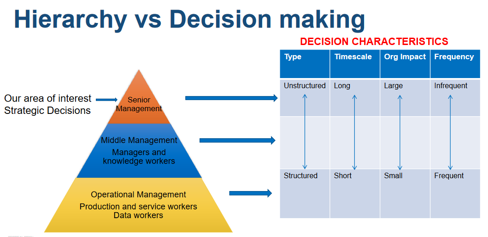

# Week 1

No tutorial

# Week 2

## Important content

This is mostly a setup week.

### General business structures

### There are 4 things to keep in mind when looking at the general structure of a business:

 - Customer segments - specific groups of people in society that organisations support, or sell to with their products or services
    - eg school kids, adults, business workers and retirees are different customer segments for a company that wants to sell Bicycles or a company that wants to sell food

 - Customer channels - are **HOW** your customers get access to your product or service
    - eg ecommerce, brick and morter stores, mobile apps

 - Product/service suppliers - organisations that supply products/services to organisations for use in internally running the business, supporting the business' creaiton and combing with other products/services for sale to the market
    - eg manufacturers buying raw materials to fabricate into components and businesses buying those components to create their products

 - Supply Businesses - similair to product suppliers, but these organisations business generates business for another org
    - governments, sports assosciations.

### Why does a business need IS systems?

To manage operations, communicate, for sales, marketing and decision making, customer and supplier intimacy and the creation of competitive advantages

### There are 4 types of information systems
 
  - Transaction Processing Systems (TPS)
    - Collects, modifies and retrieves all transaction data
        - Often used for financial transaction processing

  - Management Information System (MIS)
    - Used for monitoring and reporting daily or weekly sales and inventory data, payroll and more

  - Decision Support System (DSS)
    -  Used by middle management to generate reports and aid decision making
  
  - Executive Information System (EIS)
    - Used by execs to generate reports for strategic decision making

### What goes into an information system?
 
 - Hardware
    - Physical computer hardware
    - Input/output interfaced
    - Comms and storage devices
 
 - Software
    - Computer programs that enable the hardware to functions

 - Data
 
 - Polcies/processes
    - Governs the operation of the system

 - People
    - Users
    - Support

### Static vs adaptive systems

### The hierarchy of decision making

The higher someone is in an organistion, the more open ended, long term and infrequent a decision has to be made. We will be focusing on the highhest point of this.

#### What is strategic decision making?

A strategic decision is one that is long term, Can be based on what competitors are doing and often considers changes in technology

#### Why change?

Change is often forced upon a business due to changes in market, disruptive changes in tech, stakeholder influences, legal changes, unforseen circumstances and more.

If we don't change it can often lead to collapse in share price, loss in market share, mass resignation, loss of business and potentially business collapse

#### How do we avoid strategic failure?

To avoid failure in are strategies we should establish and follow a strategic plan. To create this we need to ask ourselves a few questions.

 - What is our current business situation?

 - What do we want the business to be?

 - Being sure to consider the businesses
   - Mission
      - The current state/purpose of the organisation
         - Why the organisation exists - What it does, who it does it for and how it accomplishes this

   - Vision
      - Defines the optimal and desired state in the future - What the organisation whts to achieve or accomplish in the medium to long term future.

   - Goals/strategies
      - Strategic objectives that indicate the expected future outcomes and guide employee efforts
   

   - Policies/values
      - Operation philosophies or principles that guide an organisations internal conduct as well as its relationship with related external parties.

### The strategic planning process

## What analysis tools can we use?

### Porters five forces analysis model

`Used to identify and analyse an industries competitive forces, those being competition, new entrants to the industry, the bargaining power that suppliers hold, the bargaining power of the customer and the customers ability to find substitutes for your products.`

### Porters five force analysis

`Shows us how we can mitigate the 5 forces acting on our organisation`

### Porters three generic strategies

`how external competitive forces are able to be harnessed`

### Nolans stage model

`ilustrates and assesses the current development of information systes within an org`

### McFarlands strategic grid

`Assess current and future applications within an org`

### Porters value chain analysis

`Analyses the value-adding of information within an organisation`

# Week 3

## What are Business Capabilities?

Describes **What** a business does, not how or why. Our capabilities can realte to other aspects of a business, as without our resources, value streams and information we cannot create capabilities.

### Examples

- Information security management
   - An IT department provides information security managemetn

- Product development
   - A marketing department develops and launches products

and so on.

## Capability Analysis

The purpose of capability analysis is to identify strengths, weaknesses, identify how to align with strategy and to plan our scope + prioritizing.

- What are out strongest and weakest capabilities?
- Which capabilities provide strategic differentiation?
- Where should we invest our resources
- Where can technology add more strategic value?
- Where can tech be used to lower cost?
- What business capability is needed?

We use a capability model that can define what an organization must be able to do to successfully execute its business model. It is an abstract and compact representation of the organizations. Is independant of the org's structure, processes etc.

## Mapping Business Capabilities

There are 2 levels of a capbility map. WE start with a very basic map.

And then move towards more customer facing capabilities.

## Capability Map levelling

- The bluieprint of capabilities for a given business
- Multiple levels (usually no more than 6)

- Each level provides deeper insight where appropriate level of analysis desired
- 1-3 is used for high level planning and business analysis
- level 3 onwards is used for IT analysis (used as input for requirements analysis)

## Value Streams and Capabilities

### What is a value stream?

- Is a visual representation of **one** of an organsiation's primary business activities
- The set of end-end activities that deliver value to external and internal takeholders
- outlines HOW value is created and delivered to stakeholders.

## Capability Assessment

There are 6 parts of a capability assessment:

- Identify strengths
- Understand weakness
- Identify limitations
- New capabilities
- Prioritize
- Aid planning

- Either:
   - Complete a high level assessment of all business capabilities and select those that may need attention
   - Only select those business capabilities that we deem as the most important
- Then create a standard unit of measure, which is usually a 3 to 5 point scale.
- Identify who is to be included in the assessment
- Perform the assessment

## Heat Mapping Capabilities

Is a colour coded capability model, which allows us to easily illustrate the current score of a capabilityS

## Capability-based analysis and planning

- Originally designed for military and government projects
- Now popular for IS system and strategy plannig
- A business capability is decribed by more than just the people perspective; it includes the process and physical perspective.

## Capbility mapping

## Capability design

## Capability to system architecture

## Understanding business models

- Retailer
- Manufacturer
- Fee for service
    - Tradies
- Subscription
    - Netflix
- Freemium
    - WinRar
- Bundling
    - Insurance companies
        - Discount if you buy more than one thing
- Market Place
    - Amazon
- Affiliate
    - Influencers
-Razor Blade
    - Razors, printers

## Building a business model

- What does the company do?
- How does the company uniquely do it?
- How does the company get paid?
- What are the key resources
- What are the costs?

- Analysis
   - Identify where to compete
      - Porter's 5 forces
   
-Planning
   - How do we compete?

- What changed?
   - Make the business model

## The business model canvas

### Customer Segments

- Mass Market
   - Represents a broard demographic for society
- Niche Market
   - Focused demographic
- Segmented
   - A range of customer decomposed into smaller gruops that can be based on age, income etc
- Diversified
   - Covers multiple degments with different needs and characteristics
- Multi-sided platform market
   - To promot consistent experience for customers, some companies will serve mutually dependent customer segments. eg afterpay.

### Value propositions

A bundle of procucts or services that create value for specific customer segments

### Channels

# Week 4

## The target operating model

### Defining target operating models

A model that demonstrats where people, technology and business processes meet.

- The TOM allows a company to apply strategy to it's operations.

- It represents at a high level how a company can be efficiently organised to deliver the strategy through its operations

- It allows common understanding by visualising the organisation across the value chain as every important business activity is represented

- It is a blueprint of how the org will meet the vision statement

- Provides a core view of capabilities, internal and external factors/drivers

- Visualises the organisation from different perspectives throughout our value chain

- represents all of the **significant** business activites, with a focus on people, process and tech

- shows Org and functional (is) structures

- Here is an example

### Logical systems architecture

Logical systems architectures illustrats the IS components within a target operating model, it focusses on conceptual, implementation free details

- Can indicate logical distribution of systems components across a network

- Logical systems architecture consists of high level IS component representations

- The components are used in target operating models to illustrate where business processes are supported by IS components

- This consists of 5 layers
   - Client
      - Where the user interacts with the application.
   - Access
      - In this tier the user accesses the business network, acts as an intermediate for communication between presentation and client tiers.
   - Presentation
      - Provides access to users, allows input/output functions, system control functions
   - Logic Service
      - Logical processing is done here, things like ERP, Emails, Business rules/calcs are done as well
   - Data
      - Layer is persistent storage where data for the logic layer is kept

### Physical systems architecutre

Contains implementation details (network types, middleware services, dbms etc). Generally renders the platform and infrastucture details with key system components

- These details can be added once logical systems architecture are in complete/stable shape

- The purpose of logical and physical architecture is to illustrate and document the respcetive logical and physical components of a system, to clearly show how those component elements relate to one another

- How can we show our target operating model which represents not only our logical IS components but also our business processes + structure

- models take many forms and appearances

### Intro to FMC modelling

FMC is used when we want to illustrate the logical components that make up a system and what business models represent

look im gonna skip most of this I dont relaly care when fmc was made and by whom

Looks like it follows the 5 layers in logical systems architecture. With client at the top etc

### FMC Notation

### FMC  design considerations

- Business model
   - Scope
   - (sub)Capabilities

- FMC
   - User roles
   - systems components
   - Capability interaction
   - Bm design principles

- Ensure that text is horizontal

- It is possible to use different fonts and sizes in labelling

- Icons and pictures can be used to supplement shapes for clarity
   - MUST be clearly labelled

### TOM to systems architecture

- Steps to build an enterprise architecture using FMC
   - Identify scope fo the model
      - identifies different parts of the business model aligned to system components that can function independently from the whole system
   - Identify Business capabilities
      - business capability analysis identifies those required to support a scope
   - Identify external roles/systems
      - those that the business does not own but needs to create it's value proposition
      - external IS systems do not bleong to the business but must be connected to provide its service
   - Which high level business requirements require IS support?
   - which functions require shared information (data)
      - business functions that will need to provide access to data can be identified by examining the value stream/capability alignments

We can illustrate this using the folowing blocks:

### Business scopes to systems

Business scopes divide a business model and provide all the elements to form a distinct and potentially standalone business

- Business scopes are generally mapped into a whole system

- Different parts of the business scope are addressed for implementation

- One of more business scoped can be mapped into one system

### Business capability to system components

- Within each scope are business capabilities which are logical parts of the business' functionality

- They are implemented through business services, processes, rules and software systems

- A business capability should be refined into several systems components, each providing specific funtions for supporting the capability

- A business capability can be supported by one or more systems components and vice versa

- Some capabilities may involve accessing external systems which are not part of the system that implements the business model

- These external systems are needed in the architecture model because they illustrate how the system operates in full

- FMC has specific indication for system components that are outside the scope of the system being modelled

### Partner roles to user roles

- Partner roles, applying to both organisations and individuals
   - These roles are mapped into user roles which apply to one or more individuals who are assigned to these roles as part of systems access

- User roles have access perms for different components of a system
   - They are allowed by the system to access to the components and any access points + storage elements

# Week 5

## Intro to project management

Why manage implementation for a solution?

- Provides direction
- Governance controles
- Control budget and resources
- Define roles and responsibilities
- Control task activity timelines

What happens when this isnt managed
- Scope can shift outwards
- Go over budget
- Missing deadlines
- Waste resources
- Project failures

### Prince2

PRojects In Controlled Environments is a process based approach for PM that provides and easy to tailor and a scaleable method to management. This method is a common standard for PM in the UK and is practicied worldwide.

The principles of prince2 is as follows:
- Continued business justification
- Learn from experience
- Defined roles and responsibilites
- Manage by stages
- Mange by exception
- Focus on products
- Tailor to suit the project environment

Prince is a water fall methodology, with stages being carried one after the other

#### Starting up a prince2 process

A quality start up process lays the foundation for a successful project. This starts with the project brief:

- Reviewed by the project board
- Is extended over a period of time, giving us the opputunity to refine it into a project initiation document.

- This should accurate reflect the project mandate + the requrements for both business and users
- KEEP IT BRIEF

## Project scope

- The scope is part of the project planning and involves determining = documenting a list of specific project goals, deliverables, tasks and deadlines. It aims to communicate key informatoion about the project and ensure that stakeholders have the correct understanding

- The scope should be defined at the very start of planning and be authorised by the project board

- Only when scope is managed properly can prince2 propperly function

- we use a scope statement to confirm common understanding of the project scope, this typically includes:
   - product/service requirements
   - summary of all deliveralbes
      - We use the SMART system
         - Specific
         - Measurable
         - Achievable
         - Relevant
         - Time bound
   - costs + schedules
   - constraints + success criteria

- all changes need to be managed
   - if we do not manage scope, scope creep can appear

## Project roles & responsibilities

- Project Board
   - Consists of
      - The executive
         - Is in charge of the business amtter, the one who takes responsibility for the project
      - Senior user
         - individual/team of experts, reflects users perspectives
      - Senior suppliers
         - This can be one or more people, protect the needs of the suppliers
- Project manager
   - plans the project
   - defines team responsibilities
   - monitors progress
   - initiates corrective action
   - reports
   - participates in control
   - facilitates day to day management
- Project assurance
   - Assurance responsibilites attributed to board members to form a system of checks and balances
      - the exec
         - responsible for the financial performance of the business
      - senior user
         - responsible for system assurance
      - senior suppliers
         - resopnsible for inbound and outbound logistics
- Change authority
   - is handled by the project team manager
   - is responsible for
      - reviewing requests for changes and off specification related ot a project
   - can delegate repsonsibilities according to change required
- Project support
   - mentors
   - risk analysts
   - admin support
- Team manager
   - can be performed by PM

## Project planning

The plan answers the Who, What, When, Why and How.

- We can only accurately plan in detail a short time in advance.

- There are three levels of planning
   - Project planning
      - High level, direction level by the project board
   - Stage plan
      - created at each stage, detailed by management level
   - Team plan
      - plan the work in work pacakges, delivering level

### Project planning process

- Design plan
   - format the planning document, using prince2 templates
- define and analyce the products
   - prince uses a product based planning technique
   - what the project delivers
   - create a product breakdown structure
      - break main product down into major products
      - break each major product down into further products
      - products described using nouns or outcome in past tense
- identify activities and dependencies
   - using Product Breakdown Structure (PBS)
   - 
      - Product description (PD)
         - Document that details nature, purpose, function and apperance of product
         - who uses product
         - supply of products
         - level of quality required
         - people or skills required to produce
      - Product Flow Diagram (PFD)
         - show how products relate to each other + sequence of production
         - 
- Prepare Estimates
   - develop a good resource requirements list
   - PM must take cost estimates seriously if they want to complete projects within budget constraints
   - it is important to know the types of ocst estimates, how to prepare cost estimates and typlical problems assosciated with IT cost estimates
- Prepare schedules
   - the work breakdown structure (WBS) is presented here as a technique
   - using the PBS and WBS to plan a project
      - PBS is developed first so that the project outcomes are clearly understood.
      - the WBS is used to organise the construction of products as a set of tasks or work packages
         - wbs packages simplify resource and team planning
         - wbs is a details delivery plan used to allocate tasks to teams and individuals

- Document the plan
   - prepaire the PID
   - pid documentation is put together at the end of the intiation stage
   - you get it

## Gantt Charts

Gant Chartts allow us to schedule all of the tasks within a project. This is important because
- We can establish a timeline
- Allows updated and control
- Identify resource needs
   - Talked about next section

There are a few Disadvantages
- Is only accurate if consistently updated and maintained
- Difficult to estimate time to complete something
   - Especially if significant positive or negative variation exists
- If behind schedule does not show source of issues

## Resources and constraints

Is anything needed to complete activities
- Estimate and allocate each to work breakdown structure package
- There are two tupes of resources
   - Capital
      - Money
      - Material
      - Equipment
      - Facilities (where you work etc)
      - etc
   - Human
      - System analysts
      - Programmer
      - DB Devs
      - Web dev
      - DBA
      - and more
- Project constraints
   - Anything that restricts or dictates a project team's action
      - cost
      - time
      - scope
      - quality
      - resources
      -risk
      - Referred to as tolerances in PRINCE2
- Availability of a resource always ahs a direct bearing on duration of an activity

## Resource levelling

- Technique used for resolving resource conflicts via delaying tasks, creating a more smoothed distribution of resource usage
   - Reduces over-allocation

- Objectives with resource levelling
   - determine the resource requirements so that they will be available at the right time
   - allow each activity to be scheudled with the smoothest possible transisiotn across resourcce usage levels

   

Why use resource levelling?
- more consistent, uniform use of resources
   - requires less management
   - enables just in time inventory policy for more expensive resources
   - results in fewer problems for project perosnnel
   - improves morale

How to schedule a project, including resource usage:
- Initial network diagram to identify critical path
- Identify and allocate resources
   - use the WBS table included resources, ES and LF
- Develop a resource loading chart
   - Initially schedule all tasks from ES
- Identify over allocated or other resource issues
- Level the resource loading chart

Example:

## Project costing

After development of good resource requirements list, PMs and their teams must develop estimates of ALL costs on resources. PM must take these estimates seriously if they want to complete a project within budget constraints. It is important to know how we estimate these costs, how to prepare these and the typical issues assosciated with IT cost estimates

- Rough Order of Magnitude (ROM)
   - estimates what a project will cost
   - can also be referred to as a ballpark estime, guesstimate etc
   - done early in a project
      - often as early as possible
      - to help PMs make project selection decisions
      - Accuracy is usually -50% +100%
         - ROM of 100 could be 50 or 200

- Budgetary estimate
   - used to allocate money into a budget
   - Many orgs develop budgets 2 years into the fugure
   - accuracy is -10% to +25%

- Definitive estimate
   - Definitive estimates are used ofr making purchasing decisions
      - Accurate estimates are required for estimating final project costs
   - definite estimates rae mde one year or less to project completion
   - accuracy -5% to +10%

## Project governance

- Is a set of policies, functions, processes, procedures and responsiblites that define establishment, management/control, programmes and portfolios
- A framework for how decisions are made in a project
- Identifies the activites that the organization does
   - And who is responsible
- This includes
   - Policies
   - Regulations
   - Functions
   - Processes
   - Procedures
   - Responsibilities
- Maintains project alignment with strategic values
- At the strategic level
   - Organisations typically need to establish the governance structures for the management of their projects
- The project board (also known as a steering commitee) or steerco is responsible fr the correct management of the project.

- There are three pillars of project governance
   - Structure
      - decision rights of all the commitees involved.
   - People
      - Comitee membership
   - Information
      - To inform decision makers and create reports
         - etc
- Alongside 4 governance principles
   - Ensure a single point of accountability
   - Project ownership is independent of asset or service ownership or other stakeholder
   - ensure seperation of
      - Stakeholder management and project decision making
      - Project and organisational governance

- Project assurance
   - Provides EXTERNAL view of how the project is progressing

- Within PRINCE2, there are 3 views of assurance
   - Business
   - User
   - Specialist
- With each view reflecting the interests of the three project board members

## PRINCE2 process model

- Is a visual representation of the prince2 proces, which identifies stages and the sequence of activities
- Handy for understand the prince2 framework

## Closing a project

- Is a formal proces that clearly defines when the project ends
- This enables official handover to client
- Disbands the project team
- And ensures that the project objectives are met

- You can close a project in one of 2 ways
   - Planned closure
      - Is the desireable outcome, confirming the completion and acceptance of the procuts by the client
   - Premature closure
      - Unideal
      - Requested by the project board

- Closure process
   - Handover of products to customer
   - Evalutating the project objectives with the actuals and write the end project report
   - Notify project board to close the project
   - Confirm delivery
      - Verify client acceptance of product
      - Confirm availability of product support
   - End project report
      - review performance
      - review benefits and if targets were met
      - review lessons learnt during project

- Unofficial project closure
   - termination by starvation
      - Is not an outright termination, but a willful neglact brought on by slowly decreasing the project resources until no longer viable.
      - This can happen!
         - Outisd ethe influence of the project manager
         - Can be hard to live with

# Week 6

This week is all about requirements, and all of the different types of requirements. In order to understand this better we need to understand something called requirements confusion

## Requirements confusion

There are 3 main reasons requirements confusion can occur
- A common practice is to refer to goals and objectives, or the expected benefits, as 'business requirements'
- People commonly use the term 'requirements' to describe the features of the product, system, software that is expected to be created
- A widely held model claims that these two types of requirements differ only in their level of detail or abstraction

As mentioned previously. Business requirements are high-level, frequently vague and can decompose into the detailed product, system or solution requirements which provide or deliver a capability

## Specify requirements

## Business requirements

- Also known as stakeholder requirements
   - STRS
- Describes characteristics of a system from the business' perspective
- They deliver the products, systems, software and processes needed for the business to create and deliver its value proposition
- Defines what a company needs to deliver its value proposition or new capability
- explains what the final goal is
- explains why it is being done
- can include long and short-term goals
- are objective and measureable
- Bsuiness requirements are often specified in the context of devloping or procuring software or other systems

### Business requirements analysis

- Identify customer needs
- Evaluate system for feasibility
- Perform technical and economic analysis
- Allocate broad functions to system elements
- Identify and constrain limitatons
- Provide system definition

- Problem recognition techniques
   - Flip it
   - The creativity dice
   - Fishbone analysis
   - Problem Tree
   - SWOT Analysis
   - Agreement certainty matrix
   - SQUID
   - Speed Boat

- Requirement gathering techniques
   - One on one interviews
   - Focus groups
   - Utilization of use cases
   - Build prototypes
   - Define requirements precisely
   - Prio requirements
   - Carry out impact analysis
   - Resolve conflict

## Solutions requirements

- Define functional operations the software system should provide from a users perspective
- Define non-functional specifications
   - How well a system performs
- Can include long and short term goals which are objective and measureable

We need to ask some basic questions to understand solutions requirements
- Why do we need a system?
- Who is it for?
- What does it need to do?
- What does it need to integrate with?
- What is the approx cost/benefit?

### Solution Analysis

- Solution requirements are features that a system must provide to fulfil system purpose
- Solution analysis studies business processes or business, to identify if its systems meet the goal set for it
   - It is also a problem solving technique that examines a systems component pieces and discovers how well those parts work together to achieve their purpose
- Systems design shows how the system will fulfil this objective, like the blueprint of a building or house, it onsists of all the specifications that give the system its form and structure.

### Solution Analysis Techniques

- Scope Definition
   - A clearly defined objectives and requirements necesary to meet a project's requirements as defined by its stakeholders
- Problem analysis
   - The process of understanding problems and needs to find the solutions that meet the requirements
- Requirements analysis
   - Determining the conditions that need to be met
- Logical design
   - Looking at the logical relationship among the objects
- Decision analysis
   - Making final choice

### Solution requirements analysis

There are 5 phases of requirements analysis

- Problem recognition
   - Clearly identifying the problem ausing analysis techniques.
   - Capability heat maps can be useful
- Evaluation and synthesis
   - Synthesise a new solution, applying your knowledge and new information
- Modelling
   - Model the solution, showing how it works
- Specification
   - Write a list of requirements
- Review   
   - Post implementation review of how well the solution is performing

## Writing requirements

There are 8 steps in writing requirements
- Atomic
   - Is self contained and capable of being independantly understood
- Concise
   - Contains no extraneous and unnecessary content
- Complete
   - Sufficient to guide further work and at the appropriate level of detail for work to continue
- Consistent
   - Aligned with the identified needs of the stakeholders and not conflicting with other requirements
- Unambiguous
   - Requirement is clear and easy to understand. With no other assosciations
- Feasible
   - Reasonable and possible within agreed terms
      - risk
      - schedule
      - budget
- Testable
   - use ur brain buddy
- Traceable
   - The source of each requirement can be recorded
- Prioritised
   - each and every requirement must be prioritized, so the team has a guideline on what to implement first

## Requirements

- Defines what a solution should do
- two different types of requirementse
   - functional
   - non-functional
- The requirements guide the solution design
- ensures the solution meets business needs
- In order to appraise a solution we need to identify what is mot important

### Functional requirements

- Things that a business would need to do even if the system was not there, and the process was manual
- Funtional means providing service to a user
- Describes the functionality or system servies
- Functional **user** requirements may be high level statements of what the system should do but functional **system** requirements should describe the system services in detail

## Non functional requirements

- Defines how well the functional requirements must perform
- States the criteria to jusdge system performance rather than a specific behaviour (which is a functional requirement)
- They apply both to system solutions and also the people and process aspects of a solution
- They are expressed in textual format and in a declarative form
   - The system must be available 99.9% of the time during business hours x-y
   - It is like a user story if you have ever done those before :)
      - I require X to do Y because Z
- NFR can be subjective and contain inherent conflicts requiring negotiation across stakeholders. many are qualitative

Non functional requirements assessment
- Availability
   - Degree to which a solution is operable and accessible when required for use, often expressed in terms of percent of time the solution is available.
- Compatibility
   - Degree to which the solution operates effectively with other components. How one process comapres to another for example
- Functionality
   - How a solution meets the users needs, including aspects such as suitability, accuracy and interoperability
- Maintainability
   - How easy a solution or component can be modified
- Performance efficiency
   - How well a solution or component performs its functions
- Portability
   - How well we can transfer from one environment to another
- Reliability
   - What it says on the tin
- Scalability
   - What if we made the solution take more traffic? or increase its workload?
- Security
   - How susceptible is the system to malicious action?
- Usability
- Certifications
   - Industry standards etc
- Compliance
   - financial, legal etc
- Localizations
   - Local language, local compliance and more
- Service level agreements
   - contraints of the organization being served the solution
- Extensibility
   - Ability to incorporate new functionality

## Requirements prioritisation

Prioritisation is necessary in order to provide a correct order of action in our solution. We use 4 methods to prioritise

- Impact-effort matrix
   - Consists of 4 quadrants in a matrix
      - Quick wins
         - Low effort, High impact items that are highly worth pursuing
      - Big Bets
         - High impact, High effort items, usually very high value
      - Money Pits
         - Low impact, high effort items that are not a good investment
      - Fill Ins
         - Low effort, low impact items that are not as required, like a low priority user story that can wait till next sprint to action.

- Feasibility, desireability and viability scorecard
   - Feasibility
      - How easy is it to build?
   - Desirability
      - How much do stakeholders want this functionality
   - Viabiity
      - Is there a positive benefit for the business

- RICE method
   - Reach
      - How many users will this requirement effect
   - Impact
      - Shareholder value
   - Confidence
      - How confident you are with your estimates in other criteria
   - Effort
      - How much work is required

- MoSCoW Analysis
   - Must Have
      - Must be satisfied for solution to be considered a success
   - Should have
      - If possible
   - Could Have
      - Desireable bt not necessary
   - Won't have
      - Not needed at this stage

### How do we decide which requirements are most important?

- Business value\
   - Relative value to the organisation
   - Common when enhancing an existing solution
- Business or Technical Risk
   - Risk is assesssed and priorities assigned
   - High risk first? or low risk first?
      - High risk ensures we can get failures out of the way early
      - Low risk ensures early big wins
- How difficult implemntation
   - Decision of hardest or easiest to implement first
- Likelihood of success
   - Quick successes first = early wins for the team
   - Gains support for the project
- Regulation or policy compliance
   - requirements impleneted based on external compliance over stakeholder interest
- Realtionship to other requirements
   - some low order requirements may require a higher value requirement to be implemented first
- Urgency

# Week 7

> Very picture heavy week. Will try to break them down via text if possible.

## Enterprise Archtecture

In the above image we can see where enterprise architecture sits, within the Tactial level. This is important to know as it acts as the intermediary interface between strategy and operations. When choosing/designing enterprise archtecture we need to do the following:

- Planning
   - Define the business need for the system
   - Often incorporates the conduct of a fesibility study
- Analysis
   - Analyse and document business requirements, gathered from shareholders + intended users
   - These include both functional and non-functional aspects of the required system
- Design
   - Developing a workable technical design for the system based on the requirements gathered during the analysis phase
- Development
   - Converting the technical design into an operational infosystem
- Testing
   - Which is conducted at various levels during and at the conclusion of the dev phase to confirm the system operates in accordance with expectations
- Implementation
   - Preparing for and conducting the changeover of the new information system
- Maintenance
   - Managing bugs and change requests that may arise during the operational life of the system
   - Post-implementation review is an almost required activity when a new system has been live for a period of time

## Sourcing Alternatives

### Hybrid approaches

A combination of sourcing approahes can be useful for specific projects or organizations. There are usually some key influences in this choice.

- Whether IS features are generic/widely available
- Whether the org has specific needs in certain areas
- Whether there are legacy systems that require integrations

- Significant issues in IS
   - Rapdi obsolescence and shorter IT cycles
   - Big data and the rapid growth of data
   - Demand fluctuations
   - Increased energy needs
   - Challenges of social and mobile tech

## How to source Enterprise Software Systems

There are 3 major ways to obtain an enterprise system:
- Bespoke
- User developed
- Commercial off the shelf (COTS)

## Bespoke Development

Custom IS solution developed from scratch by a group of qualified IS professionals to meet specific business needs. This can be taken by an in-house team or outsourced to a 3rd party. Hybrid approaches are also not uncommon

Benefits:
- Exact fit for the business
- Unique solution
   - Can deliver a competitive advantage

Potential difficulties:
- Cost
- Timeframe
- Quality
- Maintenance

## User Developed

An exclusively inhouse system that is usually developed by end-users, without any significant assistance from IT specialists. Usually undertaken on a proto-typing basis with iterative improvements to refine the solution to business need.

> 50-75% of all computing applications can be calsses as "end-user"

Benefits:
- Business user generally has excellent understanding of the proble that requires solution
   - and what the solution needs to be
- sense of ownership
- rapid devlopment
- responsive to end-user needs

Potential Difficulties:
- Insufficient end-user expertise
- Lack of adherance to standard design principles and control mechanisms
- Often developed in isolation from other IS resources/capabilities

## COTS

Direct purse/lease/rental and deployment of an existing IS solution. Which is generally a widely used application utilised by more than one company, which can be deployed either in house or externaly hosted (AWS servers etc).

Benefits:
- Imediately available
- Features are often based on industry standards/best practice
- Availability of support and regular upgrades
- Often more cost effecitve

Potential difficulties:
- Can be unfit to fit organisational needs
- feature set is available to other users
- more bespoke features could be difficult or expensive to obtain

## Acquisition alternatives

How do we choose whch IS source to acquire?

Alongside the framework above. We also have a few other factors to consider
   - Org size/number of users
      - smaller orgs often have limited experience and budget to undertake complex IS acquisitions
   - In house IS/IT expertise
      - Without a specialist in house, there is a reliance on external parties for implementation and support
   - IS/IT expertise amongst end users
      - More IT literate user base means use of COTS is more likely to be successful and self-sourcing/end-user prototyping also becomes an option
   - Criticality
      - Significant organisational reliance on a specific IS solution can influence chosen sourcing approach
   - Compexity of required IS
      - more complex business needs require thorough understanding to determine if they can be catered for by COTS solutions against more bespoke development
   - Unieuqness of the businesss or business are that requires support
      - Company specific needs often require a more bespoke solution
   - Linkages with existing applications
      - you may need to embrace an existing IS solution. Which would require bespoke development of middlware*
         - * a piece of software that acts as an intermediary layer between the new and old system

## Complexity vs uniqueness
   - Compare and contrast the propsoed solution application. How complex is it (bespoke design vs COTS)? How unique is it (Niche solutions vs COTS). We have another matrix for this :)

   

## Tendering Processes

- Tender requeest documents (RFx documents) indicate what the org is seeking, alongside any specific reuirements and contraints that need to be satisfied. The form is seeking a response on how it is to be provided
- Usually widely advertised
   - More choices
- Participating suppliers complete and submit a written tender response outlining specs of their offer
- Submitted tender responses are evaluated against pre-defined criteria

There are 4 kinds of tendering processes
- Open tendering
   - All are welcome!
- Select tendering
   - Invite only
- Multi stage
   - Large pool of respondents, with them weeding out over time using their criteria
- Invited tendering
   - Purhchase invites a limited number of suppliers to undertake the work indicated in the tender document

- Procurement of IS solutions is often handled using this process
- Tendering is the act of making an offer, bid, proposal or express of interest in a resopnse to an invitation or request for tender
- Orgs invite other business to respond to a particular need, such as the supply of goods and services, and will select an offer or tender that meets their needs and provides best value

There are a few termed processes to keep in mind
- RFI
   - Request for info
   - Open ended enquiry to the market to gather data and consolidate understanding
- EOI
   - Expression of interest
   - shortlisting potential suppliers before progressing to bids
- RFP
   - Request for proposal
   - open ended requeest to suppliers for creative solutions
- RFT
   - Request for tender
   - An oppurtunity for potential suppliers to submit an offer to supply goods or services against a detailed tender
- RFQ
   - Request for quotation
   - Wants to see which supplier can provide best price

## Request for proposal

What should you request from vendors?
- Company information
   - background/history
   - overview of their services/capabilities
   - management/key personnel bios
   - contact info
- Their solution
   - Basic summary
   - methodology/process
   - Dev plan
- List of tasks
- Timeline
- Budget
   - both the cost of their servies and required 3rd party costs
- Support and maintenance
- List of deliverables
- Proposed project eam
- Vendor references
   - past clients
   - past projects

## Proposal evalutation

There are three main steps to evaluating a proposal:

- Feature checkist, first cut exclusion
   - Used to exclude offerings lacking key features/capabilities
   - The purpose of this phase is to determine whether each proposal is sufficiently responsive to the RFP to permit complete eval
- Initial eval and scoring
   - Measure individual merits of technical components in the proposal against pre-eestablished criteria. Members of eval team wil review and score all requiremnts (see tutorial content for more info on scoring)
- Final selection and benchmarking techniques
   - Operational performance and experiences can be compared with other organisations using the solution in a similair context
   - An evalutaton system can be configured using actual company data and company staff can process actual scenarios and compare them with current practices

> I would strongly recco looking at the tutorial for more info on this.

## Introduction to cloud computing

> I already know a bit about this topic. Notes will likely be lacking :)

tldr cloud computing is a way of simulating multiple machines on one. allowing us to move resources throughout these different machines as needed. Think if I have two users on a website. One is stiting AFK and the other is actively using it. I would shift resources away from the AFK user. We are also able to run several OS on a single cloud machine.

There are 4 kinds of cloud:
- Public
- Private
- Community
   - Shared amongst a group of users. Not quite public but not quite private
- Hybrid
   - A combination of multiple cloud systems running on one

## Virtualisation

There are many differnt types of virtualistion:
OS virtualisation
- our containers can run completely different OS
   - some Linux distro and windows usually
- Platform virtualisation
   - running multiple computers
- Storage virtualisation
   - Seperating our applications and storage, forcing it to go through anintermediary layer
- Network Virtualisation
   - Think cisco meraki, combining hardware and software setup into one
- Application virtualisation
   - Allowing us to run several instances of an application to suppoort multiple users

## Cloud Service Models

You have 3 main cloud service models
- Software as a service (SaaS)
   - Licensed software that we can use on demand
   - think things like salesforce and MS office
- Platform as a service (PaaS)
   - environment where we can execute applications
   - Azure is a platform as a service
-Infrastrucutre as a service (IaaS)
   - Broken down into 2 sub headings
      - Computation as a service
         - Amazon servers sit here
      - Data as a service
         - google drive, dropbox etc

## Cloud application stack

## Cloud resource sharing

## Division of responsibilities

# Week 8

No lecture

# Week 9

## Implementation Planning

I shouldn't have to give you a definition as to what implementation means.

Implementation steps:
- State structure/scope
- Define goals and objectives
- States start and end of the project
- States deliverables
- Specifies the client/identifies stakeholders
- States resources
- States Project methodology (Ie PRINCE2)

Success factors
- Good Communcications
- Users Involvement
- Clear requirements
- Good Planing/Clear Objectives
- Excellent scope definition
- Clearly defined process
- Customer focussed

Risk factors:
- Cost overrus
- Project delays
- System stability
- Poor functionality
- Poor user training
- Poor data migration
- Scope creep

## Implementation/Integration

Not really gonna bother fleshing out the concept of integration as well

Keyword they mention is Enterprise Appliction Integration/Solution (EAI) Which essentially is the amalgamantion of an integrated system, CRM, HR, Ops, Finance all unified.

This screenshot can help illustrate this concept.

## Introduction to Integration Mechanisms

Integration models define how applications will integrate via defining the nature of and the mechanisms for integration. Which are related to the system layer.

### Presentation integration

- A presentation integration model allows the integration of new software through the existing presentations of legacy software
- This is typically used to create a new user interface but may be used to integrate with other applications

You should use the presentation integration models when you you want to do the following:
- Put a PC-based UI on an existing terminal based app in order to provide an easier to use application for the end user
- Present an interface that the user perceives to be a single application but is in fact the composite of several apps
- Integrate with an applicatoin whose only useful and implementable integration point is via its presentation.

This form of integration is useful only when it can be accomplished using the UI or presentation of the legacy applications

Pros:
- presentation integration is easy to accomplish
   - Quick to action
- Logic is usually less complex than other integration logic because it can be viewed, is easily discovered and is well documented/self describing
- When the tools used to perform this integration work well they do most of the work neeed to create the integration

Cons:
- Integration only occurs at UI level. Therefore only the data and interactions defined in legacy presentations can be assesed
- Presentation integration can have performance bottlenecks because it adds an extra layer of software to an existing application
- Underlying data and logic of existing application cannot be accessed.

### Data integration

- A data integration model allows the integration of software via access to the data that is created, maanged and stored by the software. Typically for the purposes of reusing or synchronizing data across applications
- The data integration model goes direcetly into the database or data structures of an application , bypassing presentation and business logic to create the integration.

There are a couple different tools we use for data integration:
-Database access middleware
   - focuses on provided connectivitiy to distributed databases
      - Middelware implies that these tools allow for conectivity between software components in combination with runtime capabilities to manage interactions between the software components and runtime capabilities to manage interactions between components.
      - Focuses on:
         - Exchange of quiries
         - Management of results
         - Connectivity to databases
         - Pooling of connections
         - Other housekeeping tasks
   - Data access middleware is software that facilitites access to databases through the use or creation of connectors
      - Provides run-time envrionment to manage the requests sent to these databases and returns the results

- Data transformation
   - usually compliments middleware
   - Provides ability to convert data from source database format into the target database format
      - eg convertig EBCDIC to ASCII data format.
      - Financial conversion
      - Language conversion

- Data warehousing
   - Collecing and managing data from different sources. Data warehousing connects, analyses and loads data into the data warehouses (or databases).
      - The middleware in the datawarehouse environment pulls data from various sources, handles any necessary transformations in the data and stores a large amount of data for query and analysis

- Online Analytical Processing (OLAP)
   - Performing multidimensional analysis at high speeds on large volumes of data that comes from a data wareouse or some other unified centralized data store
      - We store the data in  adata warehouse in relational datasets. OLAP extracts data from multiple relational data sets and reorganizes it into a multidimensional format that enables very fast processing and very insightful analysis

The purpose of these is to:
- Combine data from multiple sources for analysis and decision making
   - example
      - If you want to access data from multiple data sources and place it into statistical analysis software
- Provide multiple applications with Read access to data lake or common source of info
- Allow data to be extracted from one source and reformatted/updated in another
      - update customer address accross several entities

Pros:
- Greate flexibility than presentation model
- Access to a wider range of data than what is available in user interface
-allows access to complete set/subsets of data depending on the needs of new application
- This approach also simplifies access to data sources
- Allows data reuse accross all applications
- Once integration is complete it can be resused

Cons:
- By integrating at the data level applications must write any functionality required to manupulate data
- Each integration is tied to it's data model. If the model changes, the integration runs the risk of breakage. Forcing the integration to be re-written

### Logic function integration

- A functional integration model allows the integration of software for the purpose of invoking existing functionality from other new or existing applications.
- This integration is done through interfaces to the software
- Business logic is the implementation of business processing in a programming language
- The business logic contains the rules that are required to properly interpret or contstruct the data and that are not always available through the presentation

- Functional integration requires that the point of integration be in the code of the application. This point of integration could be as simple as access through an API or as difficult as requiring additional code to create a point of access

There are three catagories of distributed processing middleware:
- Messeage Oriented Middleware (MOM)
   - Passes messages between applications
   - similair concept to a post office
      - message is placed into the MOM, the MOM delivers the message to the target system

- Distributed object technology (DOT)
   - Applies object-oriented concepts to middleware
   - The interface makes software look like objects.
   - Can be accessed by other apps through the network through object interfaces

- Transaction Processing Monitors (TPM)
   - Provide mission critical support for distributed architectures by allowing a transaction to be managed using concepts such as two-phase commit
   - Preserves the integrity of distributed information resources such as databases, files and message queue

Pros:
- The functional integration model provides the most robust integration capabilities
- It is the most flexible
- Can be used to solve presentation or data integration problems
- Higher degree of reusability

Cons:
- Higher complexity
- learning curve for the software that aids in functional integration is higher than for the presentation of data integration tools
- it may be difficult to access the business logic of some applications because the source code may not exist/there are no apis

## Choosing which integration to use
- How feasable is it to access functinality in applications?
   - In some cases it may be so difficult that you would have to integrate vie the presentation or through direct data access
- Another factor is performance
   - Each integration method will be more performant than another depending on the situation.
- How much future reuse is expected to be addressed?
   - Funtional integration gives greater reusability but can be more difficult to apply, depending on the design of the code that performs the function

One of the most important outcomes of any integration is to reduce the level of coupling between the software components that are integrated.

# Week 10