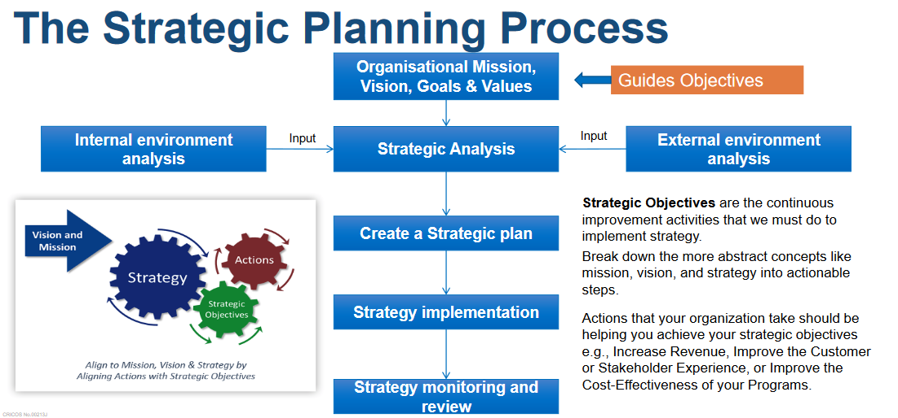

# Week 1

No tutorial

# Week 2

## Important content

This is mostly a setup week.

### General business structures

### There are 4 things to keep in mind when looking at the general structure of a business:

 - Customer segments - specific groups of people in society that organisations support, or sell to with their products or services
    - eg school kids, adults, business workers and retirees are different customer segments for a company that wants to sell Bicycles or a company that wants to sell food
 
 - Customer channels - are **HOW** your customers get access to your product or service
    - eg ecommerce, brick and morter stores, mobile apps

 - Product/service suppliers - organisations that supply products/services to organisations for use in internally running the business, supporting the business' creaiton and combing with other products/services for sale to the market
    - eg manufacturers buying raw materials to fabricate into components and businesses buying those components to create their products

 - Supply Businesses - similair to product suppliers, but these organisations business generates business for another org
    - governments, sports assosciations.

### Why does a business need IS systems?

To manage operations, communicate, for sales, marketing and decision making, customer and supplier intimacy and the creation of competitive advantages

### There are 4 types of information systems
 
  - Transaction Processing Systems (TPS)
    - Collects, modifies and retrieves all transaction data
        - Often used for financial transaction processing

  - Management Information System (MIS)
    - Used for monitoring and reporting daily or weekly sales and inventory data, payroll and more

  - Decision Support System (DSS)
    -  Used by middle management to generate reports and aid decision making
  
  - Executive Information System (EIS)
    - Used by execs to generate reports for strategic decision making

### What goes into an information system?
 
 - Hardware
    - Physical computer hardware
    - Input/output interfaced
    - Comms and storage devices
 
 - Software
    - Computer programs that enable the hardware to functions

 - Data
 
 - Polcies/processes
    - Governs the operation of the system

 - People
    - Users
    - Support

### Static vs adaptive systems

### The hierarchy of decision making

The higher someone is in an organistion, the more open ended, long term and infrequent a decision has to be made. We will be focusing on the highhest point of this.

#### What is strategic decision making?

A strategic decision is one that is long term, Can be based on what competitors are doing and often considers changes in technology

#### Why change?

Change is often forced upon a business due to changes in market, disruptive changes in tech, stakeholder influences, legal changes, unforseen circumstances and more.

If we don't change it can often lead to collapse in share price, loss in market share, mass resignation, loss of business and potentially business collapse

#### How do we avoid strategic failure?

To avoid failure in are strategies we should establish and follow a strategic plan. To create this we need to ask ourselves a few questions.

 - What is our current business situation?

 - What do we want the business to be?

 - Being sure to consider the businesses
   - Mission
      - The current state/purpose of the organisation
         - Why the organisation exists - What it does, who it does it for and how it accomplishes this

   - Vision
      - Defines the optimal and desired state in the future - What the organisation whts to achieve or accomplish in the medium to long term future.

   - Goals/strategies
      - Strategic objectives that indicate the expected future outcomes and guide employee efforts
   

   - Policies/values
      - Operation philosophies or principles that guide an organisations internal conduct as well as its relationship with related external parties.

### The strategic planning process

## What analysis tools can we use?

### Porters five forces analysis model

`Used to identify and analyse an industries competitive forces, those being competition, new entrants to the industry, the bargaining power that suppliers hold, the bargaining power of the customer and the customers ability to find substitutes for your products.`

### Porters five force analysis

`Shows us how we can mitigate the 5 forces acting on our organisation`

### Porters three generic strategies

`how external competitive forces are able to be harnessed`

### Nolans stage model

`ilustrates and assesses the current development of information systes within an org`

### McFarlands strategic grid

`Assess current and future applications within an org`

### Porters value chain analysis

`Analyses the value-adding of information within an organisation`