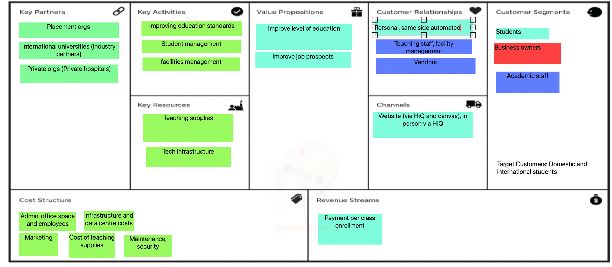

## Exercise 1

### Case study:

> For years Starbucks has been successfully maintaining its dominant position in the coffee shop market despite the market
> becoming highly competitive with many players offering similar product and service offering of Starbucks. There has also been a
> rise in strong competition from fast food chains such as McDonalds and Dunkin Donuts that now offer premium coffee, which is
> threatening the market share of established players. In order to hold onto its competitive advantage and create new value
> proposition for its customers Starbucks has started to focus on the use of information technology, mobility and particularly social
> media. One such innovative value proposition by Starbucks is the Mobile Payments Application. Starbucks launched its mobile card
> app in 16 stores in early 2009 and after customer’s adoption increased, Starbucks expanded it countrywide in United States. The
> main feature of the App allows customers to generate a 2D barcode on their mobile device to be scanned and used as payment in
> stores. The App is an extension of Starbucks’ existing, tangible, pre-paid reward card for loyal customers. The App is marketed
> based on its benefits in saving time and making purchases more convenient for the customer. Starbucks refers to the App as “the
> fastest way to pay.” With this App customers can check their balance, reload card with any major credit card or PayPal, view
> transactions and conveniently track their Stars in the MSR (My Starbucks Rewards) program. The advantages for consumers are
> speed and one less card in their wallets. Using the app customers can also locate a mobile payment Starbucks near their location.

#### Question: List the data types stored in the information system used by Starbucks and explain what information the system provides.

The data types that are stores within this informaiton system are as follows:

- Rewards card detail
    - Rewards card number
    - Current amount of points
    - Star count
            - Allows us to know how many points the customer has for when they go to use their points. Without this info the customer is unable to properly use their rewards points
- Customer details
    - Name
    - Date of birth?
    - Customer number (identifying customers by name would be archaic)
        - Allows us to link purchases up to a customer, giving us options to 

- Payment information
    - Card number
    - Expiry
    - Security code

- Store details
    - Store location
    - If store is participating in mobile payment
    - Current inventory

- Previous order details
    - Helps with strategic decision making - understanding what the customer wants to use

- Transaction history

## Exercise 2

### Case study:
> Restaurant ABC was a small family-owned restaurant near to a ski resort in Tasmania. The restaurant was recently
> acquired to be a part of the ski resort. The new owners would like to make major improvement in the restaurant. The
> manager of the ski resort, while hardworking and enthusiastic, has very little experience in the restaurant business.
> Shortly after taking over the restaurant, management of the ski resort held a day-long meeting with all the employees
> of the restaurant to discuss the future of the ski resort and the new strategic plans for it. At the end of this meeting,
> management and employees agreed that they need to improve customers’ satisfaction and improve weekly sales.
> average time to take an order and the average time to prepare an order were too long. They agreed that they should
> improve them and increase number of menu items. The managers realised that they may need to implement a new
> restaurant operating system to be able to achieve those objectives. Besides a new system, managers also decided to
> improve their kitchen staffs’ cooking skills and the hospitality skills of dining room staffs by sending those staffs to a
> basic cooking course and a basic hospitality course.

#### Question: Identiy objectives and explain to which of the four perspectives each objective belongs

- Objectives
    - Improve efficiency
        - Upskilling staff
        - Move away from manual order taking systems
        - Broaden menu
        - Improve customer satisfaction
        - Drive weekly sales

Four perspectives
- Learning and growth
    - Upskilling staff
        - Investing in staff learning
    - Moving away from manual order taking system and moving towards a Point of Sales (POS) system
        - This new system allows floor staff to spend more time on the customer and less time communciating orders to the kitchen

- Internal Business
    - Broaden menu

- Customer Perspecitve
    - improve customer satisfaction

- Financial perspectives
    - Drive weekly sales

## Exercise 3

> Read the case study, I am not putting that in here its a wall of text

## Discuss in group the following
 - Use Porter's five forces to conduct strategic analysis
    
    - Competitive rivalry
        - Map My Fitness (Under Armour)
            - Plethora of user data with a refusal to sell
        - Gatorade
            - Smart water bottle providing optimal hydration

    - Threat of new entrants
        - 

    - Buyer power
        - 

    - Supplier power
        -

    - Threat of substitution
        - 

    - Threat of substitute products
        - 

 - Discuss what competitive strategies Nike pursued

    - Build customer loyalty
        - By creating an extensive ecosystem, Nike aimes to "lock" their customers into using their products over everyone else. As all of their devices work seamlessly with one another.
        - Nike created their own fitness apps to compete with MapMyFitness.
        - Focus marketing on athletes

# Week 3

## Exercise 1 - Hotel Ibis
> Ibis (corporately styled, ibis) is an international hotel company owned by AccorHotels. Ibis hotels are offering a 24-
> hour reception. Rooms provide a bathroom and shower room, a desk, a double or two single beds, wardrobe space,
> and international and local TV channels. The hotel sometimes includes a restaurant or bar offering breakfast from
> 4:00am-12:00pm, and in some hotels a 24-hour snack menu is offered

> Airbnb is an online marketplace for arranging or offering lodging, primarly homestays or tourism experiences, company does not own any of the real estate listings, nor does it host events, it acts as a broker, receiving commissions fromeach booking.

Identify at least 4 differences between their business models
- Customer segments
    - Ibis is Segmented
        - They serve a wide range of clients but they all have the same need. somewhere to stay
    - Airbnb is also segmented - Maybe niche market?

- Value Propositions
    - Ibis offers
        - 24 hour reception
        - serviced rooms
        - customizable room options
        - broad range of tv channels
        - restaurants and eateries
        - consistency between all ibis establishments
    - Airbnb offers
        - A variety of different stays in unique places
        - the oppurtunity to "live like a local"
        - the ability to list your property as a hotel

- Channels
    - Ibis
        - Online booking
        - asking about stays on front desk
    - Airbnb
        - Online booking

- Customer Relationships
    - Ibis
        - Self Services
            - More often than not the customer will book online. in which they are left to choose their room, the term of their stay etc.
    - Airbnb
        - Automated Services
            - both listing and registering a stay is done independantly

- Revenue Streams
    - Ibis
        - Leasing fee
    - Airbnb
        - Brokerage fees
            - Takes a fee off the top when a lodger stays in a location

- Key resources
    - Ibis
        - Buildings
        - Staff (both customer facing and support staff)
    - Airbnb
        - Human (people listing their homes)
        - Staff (Mostly support staff)
        - IT (app)

- Key activites
    - ?

- Key Partnerships
    - Ibis
        - Catering companies
            - To provide food to on-site restaurants
        - Local tourism firms
            - to promote eachother to their customers
        - Laundry/cleaning companies
        - real estate
    - Airbnb
        - Owners of the homes that they put up for rent

- Cost Structure
    - Ibis
        - Fixed Cost
            - the same room in the same place will always be priced the same
    - Airbnb
        - Variable cost
            - Every single listing is different with the home owner dictating the price 

## Exercise 2 - QUT Business Model

> Draw on your knowledge to build a business model canvas for QUT

- Not enough time skull

- Where I got up to

## Exercise 3 - Amazon Go

Compare Amazon Go's business model with Woolworths

- Same customer segment

- Value propositions
    - Woolies has easy to access grocery products
    - Amazon builds on this by developing and maintain computer vision, develop and maintain app

- Key Resources
    - Woolies has products, stores and employees
    - Amazon bulds on this with all of their IT and IOT infrastcutures

# Week 4

sick - ceebs catching it up :)

# Week 5

# Week 6

# Week 7

# Week 8

# Week 9