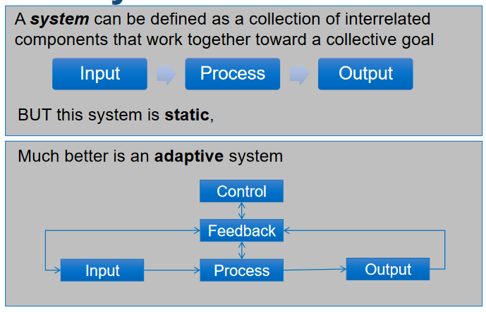
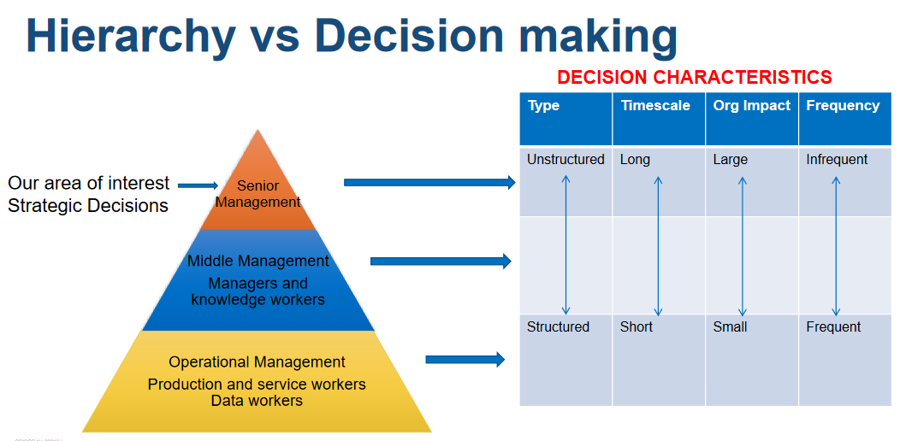

# Week 1

No tutorial

# Week 2

## Important Content

This is mostly a setup week.

### General Business Structures

### There are 4 things to keep in mind when looking at the general structure of a business:

 - Customer segments - specific groups of people in society that organisations support, or sell to with their products or services
    - eg school kids, adults, business workers and retirees are different customer segments for a company that wants to sell Bicycles or a company that wants to sell food
 
 - Customer channels - are **HOW** your customers get access to your product or service
    - eg ecommerce, brick and morter stores, mobile apps

 - Product/service suppliers - organisations that supply products/services to organisations for use in internally running the business, supporting the business' creaiton and combing with other products/services for sale to the market
    - eg manufacturers buying raw materials to fabricate into components and businesses buying those components to create their products

 - Supply Businesses - similair to product suppliers, but these organisations business generates business for another org
    - governments, sports assosciations.


### Why does a business need IS systems?

To manage operations, communicate, for sales, marketing and decision making, customer and supplier intimacy and the creation of competitive advantages

### There are 4 types of information systems
 
  - Transaction Processing Systems (TPS)
    - Collects, modifies and retrieves all transaction data
        - Often used for financial transaction processing

  - Management Information System (MIS)
    - Used for monitoring and reporting daily or weekly sales and inventory data, payroll and more

  - Decision Support System (DSS)
    -  Used by middle management to generate reports and aid decision making
  
  - Executive Information System (EIS)
    - Used by execs to generate reports for strategic decision making

### What goes into an information system?
 
 - Hardware
    - Physical computer hardware
    - Input/output interfaced
    - Comms and storage devices
 
 - Software
    - Computer programs that enable the hardware to functions

 - Data
 
 - Polcies/processes
    - Governs the operation of the system

 - People
    - Users
    - Support

### Static vs adaptive systems



### The hierarchy of decision making

The higher someone is in an organistion, the more open ended, long term and infrequent a decision has to be made. We will be focusing on the highhest point of this.



#### What is strategic decision making?

A strategic decision is one that is long term, Can be based on what competitors are doing and often considers changes in technology

#### Why change?


## Exercise 1

### Case Study:

>For years Starbucks has been successfully maintaining its dominant position in the coffee shop market despite the market
>becoming highly competitive with many players offering similar product and service offering of Starbucks. There has also been a
>rise in strong competition from fast food chains such as McDonalds and Dunkin Donuts that now offer premium coffee, which is
>threatening the market share of established players. In order to hold onto its competitive advantage and create new value
>proposition for its customers Starbucks has started to focus on the use of information technology, mobility and particularly social
>media. One such innovative value proposition by Starbucks is the Mobile Payments Application. Starbucks launched its mobile card
>app in 16 stores in early 2009 and after customer’s adoption increased, Starbucks expanded it countrywide in United States. The
>main feature of the App allows customers to generate a 2D barcode on their mobile device to be scanned and used as payment in
>stores. The App is an extension of Starbucks’ existing, tangible, pre-paid reward card for loyal customers. The App is marketed
>based on its benefits in saving time and making purchases more convenient for the customer. Starbucks refers to the App as “the
>fastest way to pay.” With this App customers can check their balance, reload card with any major credit card or PayPal, view
>transactions and conveniently track their Stars in the MSR (My Starbucks Rewards) program. The advantages for consumers are
>speed and one less card in their wallets. Using the app customers can also locate a mobile payment Starbucks near their location.


#### Question: List the data types stored in the information system used by Starbucks and explain what information the system provides.

## Exercise 2


### Case Study:
>Restaurant ABC was a small family-owned restaurant near to a ski resort in Tasmania. The restaurant was recently
>acquired to be a part of the ski resort. The new owners would like to make major improvement in the restaurant. The
>manager of the ski resort, while hardworking and enthusiastic, has very little experience in the restaurant business.
>Shortly after taking over the restaurant, management of the ski resort held a day-long meeting with all the employees
>of the restaurant to discuss the future of the ski resort and the new strategic plans for it. At the end of this meeting,
>management and employees agreed that they need to improve customers’ satisfaction and improve weekly sales.
>Previously, all orders, payments, reservations etc. were manually done and the menu was very limited. Therefore, the
>average time to take an order and the average time to prepare an order were too long. They agreed that they should
>improve them and increase number of menu items. The managers realised that they may need to implement a new
>restaurant operating system to be able to achieve those objectives. Besides a new system, managers also decided to
>improve their kitchen staffs’ cooking skills and the hospitality skills of dining room staffs by sending those staffs to a
>basic cooking course and a basic hospitality course.


#### Question: Identiy objectives and explain to which of the four perspectives each ogjective belongs

## Exercise 3

```
Read the case study from the text book (lame)
```

## Discuss in group the following
 - Use Porter's five forces to conduct strategic analysis
 - Discuss what competitive strategies Nike pursued